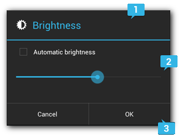
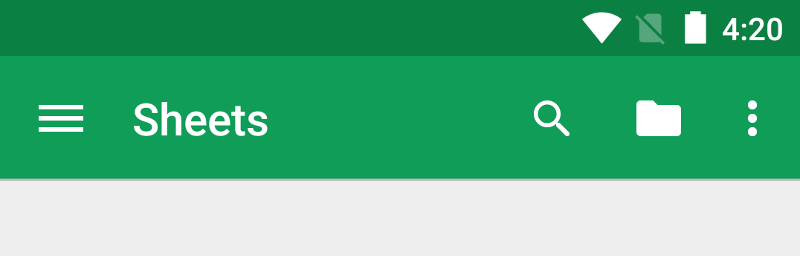

# **`Android`**

## **App Icon**

Android Studio menyertakan tool yang disebut Image Asset Studio yang membantu untuk membuat ikon Aplikasi sendiri dari ikon material, gambar khusus, dan string teks. Proses ini menghasilkan sekumpulan ikon dengan resolusi yang sesuai untuk setiap pixel density yang didukung Aplikasi. Image Asset Studio menempatkan ikon yang baru dibuat dalam folder density-sepesifi di dalam folder `res/` dalam proyek Android. Saat runtime, Android menggunakan resource yang sesuai berdasarkan pixel density layar perangkat tempat aplikasi berjalan.

Image Asset Studio membantu untuk membuat jenis ikon dibawah ini:

1. Launcher icons
2. Action bar and tab icons
3. Notification icons

### `Adaptive and legacy launcher icons`

Icon launcher adalah grafik yang mewakili aplikasi kepada user. Icon launcher dapat:

1. Muncul di daftar aplikasi yang diinstal di perangkat dan di layar Beranda.
2. Mewakili pintasan ke aplikasi (misalnya, ikon pintasan kontak yang membuka informasi detail untuk kontak).
3. Digunakan oleh launcher app.
4. Membantu user menemukan aplikasi di Google Play.

### `Action bar and tab icons`

Ikon bar action adalah elemen grafis yang ditempatkan di app bar action yang mewakili item aksi individu.

Ikon tab adalah elemen grafis yang digunakan untuk mewakili tab individu dalam antarmuka multi-tab. Setiap ikon tab memiliki dua status: tidak dipilih atau dipilih.

### `Notification icons`

Notifikasi adalah pesan yang dapat ditampilkan kepada user di luar UI normal pada aplikasi. Image Asset Studio menempatkan ikon notifikasi di lokasi yang baik di direktori `res/drawable-density/`

### `Clip Art`

Image Asset Studio memudahkan dalam mengimpor ikon material Google dalam format VectorDrawable dan PNG: cukup pilih ikon dari dialog Image Asset Studio saja.

### `Images`

Android dapat mengimpor gambar sendiri dan menyesuaikannya dengan jenis ikon. Image Asset Studio mendukung jenis file berikut: PNG (lebih disukai) JPG (dapat diterima) dan GIF (tidak disarankan).

### `Text Strings`

Image Asset Studio memungkinkan untuk mengetik string teks dalam berbagai font dan menempatkannya pada ikon. Text Strings mengubah ikon berbasis teks menjadi file PNG untuk pixel density yang berbeda.

### `Run Image Asset Studio`

Untuk menjalan Image Asset Studio pada Android Studio, ikut langkah dibawah ini:

1. Pada window project, pilih tampilan Android pada dropdown pada gambar dibawah ini: 
2. Klik kanan pada **Windows** dan **Linux** atau CTRL + CLICK untuk **macOS** pada folder `res` (tanpa ada hint generated), kemudian pilih **New > Image Asset** maka akan muncul dialog seperti dibawah ini: 

### `Refer to an image resource in code`

Aplikasi biasanya dapat merujuk ke resource gambar dengan cara umum dalam kode dan saat aplikasi berjalan, gambar yang sesuai akan ditampilkan secara otomatis bergantung pada perangkatnya:

- Dalam kebanyakan kasus, Aplikasi bisa merujuk ke resource gambar sebagai @drawable dalam kode XML atau Drawable dalam kode Java / Kotlin.

```Xml
<ImageView
    android:layout_height="wrap_content"
    android:layout_width="wrap_content"
    android:src="@drawable/myimage" />
```

```Kotlin
val drawable = resources.getDrawable(R.drawable.myimage, theme)
```

- Setelah memiliki resource gambar di direktori `res/` pada proyek Android, kemudian bisa mereferensikannya dari kode Java / Kotlin atau layout XML dengan menggunakan ID resourcenya.

```Kotlin
findViewById<ImageView>(R.id.myimageview).apply {
    setImageResource(R.drawable.myimage)
}
```

Untuk ikon launcher, pada file AndroidManifest.xml harus merujuk ke lokasi folder `mipmap/` Image Asset Studio menambahkan folder ini secara otomatis.

```Kotlin
<application android:name="ApplicationTitle"
         android:label="@string/app_label"
         android:icon="@mipmap/ic_launcher" >
```

## **Dialog**

Dialog adalah jendela kecil yang meminta user untuk mengambil keputusan atau memasukkan informasi tambahan. Dialog tidak memenuhi layar pada Android dan biasanya digunakan untuk peristiwa modal yang mengharuskan pengguna mengambil tindakan sebelum mereka dapat melanjutkan suatu proses.

### `Type of Dialogs`

Class Dialog adalah class dasar untuk membuat dialog, tetapi harus menghindari membuat instance Dialog secara langsung. Sebagai gantinya, gunakan salah satu subclass berikut ini:

1. **AlertDialog**: Dialog yang dapat menampilkan judul, hingga tiga tombol, daftar item yang dapat dipilih atau kustom layout.

2. **DatePickerDialog** atau **TimePickerDialog**: Dialog dengan UI yang telah ditentukan sebelumnya yang memungkinkan pengguna untuk memilih tanggal atau waktu.

### `Creating a Dialog Fragment`

Berbagai macam desain dialog, termasuk layout khusus dengan meng-extend DialogFragment dan membuat AlertDialog dalam metode callback `onCreateDialog()`.

Berikut ini adalah AlertDialog dasar yang dikelola di dalam DialogFragment:

```Kotlin
class FireMissilesDialogFragment : DialogFragment() {
    override fun onCreateDialog(savedInstanceState: Bundle): Dialog {
        return requireActivity().let {
            val builder = AlertDialog.Builder(it)
            builder.setMessage(R.string.dialog_fire_missiles)
                    .setPositiveButton(R.string.fire,
                            DialogInterface.OnClickListener { dialog, id ->
                                // FIRE ZE MISSILES!
                            })
                    .setNegativeButton(R.string.cancel,
                            DialogInterface.OnClickListener { dialog, id ->
                                // User cancelled the dialog
                            })
            builder.create()
        }
    }
}
```

Setelah membuat class DialogFragment diatas panggil method `show()` pada object tersebut dan akan menampilkan dialog seperti dibawah ini:


### `Build an Alert Dialog`

Class AlertDialog memungkinkan untuk membuat berbagai desain dialog dan seringkali merupakan satu-satunya class dialog yang diperlukan. Seperti yang ditunjukkan pada gambar dibawah ini:



Title
Ini opsional dan harus digunakan hanya jika area konten ditempati oleh pesan yang terperinci, daftar, atau kustom layoyt. Jika perlu menyatakan pesan atau pertanyaan sederhana (seperti dialog di gambar diatasnya) yang tidak memerlukan judul.

Content Area
Ini dapat menampilkan pesan, daftar atau kustom layout lainnya.

Action Buttons
Seharusnya tidak ada lebih dari tiga tombol tindakan dalam dialog.

Class AlertDialog.Builder menyediakan API yang memungkinkan untuk membuat AlertDialog dengan jenis konten ini, termasuk dengan kustom layout.

Untuk membuat AlertDialog, bisa dengan meniru kode dibawah ini:

**Activity.kt**

```Kotlin
val builder: AlertDialog.Builder? = activity?.let {
    AlertDialog.Builder(it)
}

builder?.apply {
    setPositiveButton(R.string.ok,
            DialogInterface.OnClickListener { dialog, id ->
                // User clicked OK button
            })
    setNegativeButton(R.string.cancel,
            DialogInterface.OnClickListener { dialog, id ->
                // User cancelled the dialog
            })
}

builder?.setMessage(R.string.dialog_message)
        .setTitle(R.string.dialog_title)

val dialog: AlertDialog? = builder?.create()
dialog?.show()
```

Ada tiga tombol aksi berbeda yang dapat ditambahkan:

1. **Positive Button**: menggunakan button ini untuk menerima dan melanjutkan tindakan (tindakan "OK").

2. **Negative Button**: menggunakan button ini untuk membatalkan tindakan.

3. **Neutral Button**
   Menggunakan button ini jika user mungkin tidak ingin melanjutkan tindakan, tetapi tidak ingin membatalkannya. Neutral Button muncul di antara tombol positif dan negatif. Misalnya, tindakannya mungkin "Remind me later".

### `Creating a Custom Layout`

Jika menginginkan layout khusus dalam dialog, buat layout dan tambahkan ke AlertDialog dengan memanggil method `setView()` pada objek AlertDialog.Builder.

Secara default, layout kustom mengisi jendela dialog, tetapi masih dapat menggunakan metode AlertDialog.Builder untuk menambahkan tombol dan judul.

Contoh kustom layout pada dialog:


**dialog_signin.xml**

```Xml
<LinearLayout xmlns:android="http://schemas.android.com/apk/res/android"
    android:orientation="vertical"
    android:layout_width="wrap_content"
    android:layout_height="wrap_content">

    <ImageView
        android:src="@drawable/header_logo"
        android:layout_width="match_parent"
        android:layout_height="64dp"
        android:scaleType="center"
        android:background="#FFFFBB33"
        android:contentDescription="@string/app_name" />

    <EditText
        android:id="@+id/username"
        android:inputType="textEmailAddress"
        android:layout_width="match_parent"
        android:layout_height="wrap_content"
        android:layout_marginTop="16dp"
        android:layout_marginLeft="4dp"
        android:layout_marginRight="4dp"
        android:layout_marginBottom="4dp"
        android:hint="@string/username" />

    <EditText
        android:id="@+id/password"
        android:inputType="textPassword"
        android:layout_width="match_parent"
        android:layout_height="wrap_content"
        android:layout_marginTop="4dp"
        android:layout_marginLeft="4dp"
        android:layout_marginRight="4dp"
        android:layout_marginBottom="16dp"
        android:fontFamily="sans-serif"
        android:hint="@string/password"/>

</LinearLayout>
```

Untuk inflate layout dalam DialogFragment, pertama dapatkan LayoutInflater dengan memangil method `getLayoutInflater()` dan panggil `inflate()`, di mana parameter pertama adalah ID resource layout dan parameter kedua adalah root view untuk layout. Kemudian memanggil `setView()` untuk menempatkan layout dalam dialog.

```Kotlin
override fun onCreateDialog(savedInstanceState: Bundle?): Dialog {
    return requireActivity().let {
        val builder = AlertDialog.Builder(it)
        val inflater = it.layoutInflater

        builder.setView(inflater.inflate(R.layout.dialog_signin, null))
                .setPositiveButton(R.string.signin,
                        DialogInterface.OnClickListener { dialog, id ->
                            // sign in the user ...
                        })
                .setNegativeButton(R.string.cancel,
                        DialogInterface.OnClickListener { dialog, id ->
                            getDialog().cancel()
                        })
        builder.create()
    }
}
```

## **Menu**

Menu adalah komponen user interface yang umum pada aplikasi apapun. Untuk memberikan pengalaman pengguna yang akrab dan konsisten harus menggunakan API Menu untuk menyajikan tindakan user dan opsi lain dalam Activity atau Fragment.

### `Types of Menu`

Berikut adalah beberapa jenis menu yang biasa digunakan di Android:

1. **Options menu and app bar**: Menu opsi adalah kumpulan item menu utama yang dipakai untuk suatu Activity. Di sinilah harus menempatkan tindakan yang berdampak global pada aplikasi, seperti "Search", "Compose email" dan "Setting". 

2. **Context menu and contextual action mode**: Menu konteks adalah menu terangkat yang muncul saat user melakukan klik suatu elemen. Ini memberikan tindakan yang mempengaruhi konten yang dipilih atau bingkai konteks. Contextual action mode menampilkan item tindakan yang memengaruhi konten yang dipilih di bar pada bagian atas layar dan memungkinkan user untuk memilih beberapa item. 

3. **Popup menu**: Menu popup menampilkan daftar item dalam daftar vertikal yang ditambatkan ke tampilan yang memanggil menu tersebut. Hal ini bagus untuk memberikan luapan tindakan yang berhubungan dengan konten tertentu atau untuk memberikan opsi untuk bagian kedua dari sebuah perintah. Tindakan dalam popup menu tidak boleh secara langsung memengaruhi konten terkait — untuk itulah contextual action. Sebaliknya, menu popup ditujukan untuk tindakan tambahan yang berhubungan dengan wilayah konten dalam aktivitas. 

### `Defining a Menu in XML`

Untuk semua jenis menu, Android menyediakan format XML standar untuk menetukan item menu, daripada membuat menu secara programn di Activity. Menu dan semua item menu pada Android didefinisikan dalam menu resource XML. Kemudian menu dapat diinflate pada MenuInflater di Activity atau Fragment.

Menu resource Android menjadi praktik yang baik untuk beberapa alasan dibawah ini:

1. Lebih mudah dalam memvisualisasikan struktur menu di dalam XML.
2. Memisahkan antara konten menu pada aplikasi dengan kode dari Activity.
3. Memungkinkan untuk membuat konfigurasi menu alternatif untuk berbagai versi platform, ukuran layar, dan konfigurasi lain dengan memanfaatkan framework app resource.

`<menu>`
Mendefinisikan Menu, yang merupakan wadah untuk item menu. Elemen `<menu>` harus menjadi simpul akar untuk file dan dapat menampung satu atau lebih elemen `<item>` dan `<group>`.

`<item>`
Membuat MenuItem, yang mewakili satu item dalam menu. Elemen ini mungkin berisi elemen `<menu>` bertingkat untuk membuat submenu.

`<group>`
Penampung opsional yang tidak terlihat untuk elemen `<item>`. Ini memungkinkan untuk mengkategorikan item menu sehingga mereka berbagi properti seperti status aktif dan visibilitas.

**game_menu.xml**

```Xml
<?xml version="1.0" encoding="utf-8"?>
<menu xmlns:android="http://schemas.android.com/apk/res/android">
    <item android:id="@+id/new_game"
          android:icon="@drawable/ic_new_game"
          android:title="@string/new_game"
          android:showAsAction="ifRoom"/>
    <item android:id="@+id/help"
          android:icon="@drawable/ic_help"
          android:title="@string/help" />
</menu>
```

`android:id`
ID sumber daya yang unik untuk item tersebut, yang memungkinkan aplikasi mengenali item ketika user memilihnya.

`android:icon`
Referensi ke drawable untuk digunakan sebagai ikon item.

`android:title`
Referensi ke string untuk digunakan sebagai judul item.

`android:showAsAction`
Menentukan kapan dan bagaimana item ini harus muncul sebagai item tindakan pada bar aplikasi.

**group_menu.xml**

```Xml
<?xml version="1.0" encoding="utf-8"?>
<menu xmlns:android="http://schemas.android.com/apk/res/android">
    <item android:id="@+id/file"
          android:title="@string/file" >
        <!-- "file" submenu -->
        <menu>
            <item android:id="@+id/create_new"
                  android:title="@string/create_new" />
            <item android:id="@+id/open"
                  android:title="@string/open" />
        </menu>
    </item>
</menu>
```

### `Create Option Menu`

Untuk menentukan menu opsi untuk suatu Activity, ubah method onCreateOptionsMenu() (Fragment menyediakan callback onCreateOptionsMenu() tersendiri). Dalam method ini dapat inflate sumber daya menu (didefinisikan dalam XML) ke dalam Menu yang disediakan dalam callback. Sebagai contoh:

**Activity.kt**

```Kotlin
override fun onCreateOptionsMenu(menu: Menu): Boolean {
    val inflater: MenuInflater = menuInflater
    inflater.inflate(R.menu.game_menu, menu)
    return true
}
```

### `Handling click events`

Saat user memilih item dari menu opsi (termasuk item tindakan di bar aplikasi), sistem akan memanggil method onOptionsItemSelected() di Activity. Metode ini melewati MenuItem yang dipilih. Kemudian akan mengidentifikasi item dengan memanggil getItemId() yang mengembalikan ID unik untuk item menu (ditentukan oleh atribut android:id dalam resource menu atau dengan integer yang diberikan ke metode add()). Setelah ini baru dapat mencocokkan ID ini dengan item menu yang diketahui untuk melakukan tindakan yang di sesuaikan. Sebagai contoh:

**Activity.kt**

```Kotlin
override fun onOptionsItemSelected(item: MenuItem): Boolean {
    // Handle item selection
    return when (item.itemId) {
        R.id.new_game -> {
            newGame()
            true
        }
        R.id.help -> {
            showHelp()
            true
        }
        else -> super.onOptionsItemSelected(item)
    }
}
```

## **RecyclerView**

RecyclerView memudahkan untuk menampilkan kumpulan data yang besar secara efisien. RecyclerView menyediakan kumpulan data dan menentukan tampilan untuk setiap item, dan library RecyclerView secara dinamis membuat elemen saat dibutuhkan saja.

Seperti namanya, RecyclerView berarti mendaur ulang elemen individual tersebut. Saat item di-scroll dari layar, RecyclerView tidak merusak tampilannya. Sebaliknya, RecyclerView menggunakan kembali tampilan untuk item baru yang telah di-scroll di layar. Penggunaan ulang ini sangat meningkatkan kinerja, meningkatkan responsivitas aplikasi dan mengurangi konsumsi daya.

### `Installation`

Untuk menggunakan RecyclerView, perlu ditambahkan sbeuah package pada `build.gradle` app:

```Groovy
implementation 'com.google.android.material:material:1.2.1'
```

### `Steps to Use RecyclerView`

Jika akan menggunakan RecyclerView, ada beberapa hal yang perlu dilakukan. Disini akan dibahas secara rinci di bagian berikut ini.

Pertama-tama, tentukan seperti apa tampilan item dari list. Biasanya akan menggunakan salah satu LayoutManager pada library RecyclerView.

Desain bagaimana setiap elemen dalam daftar akan terlihat dan diperlakukan. Berdasarkan desain ini, perlu sebuah class yang meng-extend dari class ViewHolder. ViewHolder menyediakan semua fungsionalitas untuk item pada list. View holder adalah pembungkus di sekitar view dan tampilan tersebut dikelola oleh RecyclerView.

Tentukan Adapter yang mengaitkan data list dengan tampilan ViewHolder.

### `LayoutManager`

Item pada RecyclerView diatur oleh kelas LayoutManager. Library RecyclerView menyediakan tiga LayoutManager yang umum digunakan dalam menangani situasi layout:

1. LinearLayoutManager mengatur item dalam daftar satu dimensi.
2. GridLayoutManager mengatur semua item dalam kisi dua dimensi:
   - Jika grid disusun secara vertikal, GridLayoutManager mencoba membuat semua elemen di setiap baris memiliki lebar dan tinggi yang sama, tetapi baris yang berbeda dapat memiliki ketinggian yang berbeda pula.
   - Jika grid disusun secara horizontal, GridLayoutManager mencoba membuat semua elemen di setiap kolom memiliki lebar dan tinggi yang sama, tetapi kolom yang berbeda dapat memiliki lebar yang berbeda pula.
3. StaggeredGridLayoutManager mirip dengan GridLayoutManager, tetapi tidak mengharuskan item dalam satu baris memiliki tinggi yang sama (untuk kisi vertikal) atau item dalam kolom yang sama memiliki lebar yang sama (untuk kisi horizontal). Hasilnya adalah item dalam satu baris atau kolom dapat saling mengimbangi.

### `Implement RecyclerView`

Setelah menentukan layoutnya selanjutnya perlu menerapkan Adapter dan ViewHolder pada RecyclerView. Kedua kelas ini bekerja sama untuk menentukan bagaimana data akan ditampilkan. ViewHolder adalah pembungkus di sekitar Tampilan yang berisi layout untuk item individu dalam sebuah list. Adapter membuat objek ViewHolder sesuai kebutuhan dan juga menyetel data untuk tampilan tersebut. Proses mengaitkan tampilan ke datanya disebut binding data.

Saat membuat adapter perlu mengganti tiga metode utama dari RecyclerView.Adapater yaitu:

1. onCreateViewHolder(): RecyclerView memanggil metode ini setiap kali perlu membuat ViewHolder baru. Metode ini membuat dan menginisialisasi ViewHolder dan View terkaitnya, tetapi tidak mengisi konten tampilan — ViewHolder belum terikat ke data tertentu.

2. onBindViewHolder(): RecyclerView memanggil metode ini untuk mengaitkan ViewHolder dengan data. Metode mengambil data yang sesuai dan menggunakan data tersebut untuk mengisi layout di view holder. Misalnya, jika RecyclerView menampilkan daftar nama, metode tersebut mungkin menemukan nama yang sesuai dalam daftar dan mengisi tampilan pada widget TextView.

3. getItemCount(): RecyclerView memanggil metode ini untuk mendapatkan ukuran kumpulan data. Misalnya, dalam aplikasi buku alamat, ini mungkin jumlah total alamat. RecyclerView menggunakan ini untuk menentukan kapan tidak ada lagi item yang bisa ditampilkan.

Berikut adalah contoh umum adapter sederhana dengan ViewHolder yang menampilkan daftar data. Dalam kasus ini, RecyclerView menampilkan daftar elemen teks sederhana. Adapter meneruskan larik string, berisi teks untuk elemen ViewHolder.

**UserAdapter.kt**

```Kotlin
class UserAdapter(private val context: Context) : RecyclerView.Adapter<UserAdapter.ViewHolder>() {

    private var users = listOf<UserModel>()

    fun setData(list: List<UserModel>) {
        users = list
        notifyDataSetChanged()
    }

    inner class ViewHolder(private val binding: ItemUserBinding) : RecyclerView.ViewHolder(binding.root) {
        fun bindData(userModel: UserModel) {
            binding.run {
                tvId.text = userModel.id.toString()
                tvName.text = userModel.name
            }
        }
    }

    override fun onCreateViewHolder(parent: ViewGroup, viewType: Int): ViewHolder {
        return ViewHolder(ItemUserBinding.inflate(LayoutInflater.from(context), parent, false))
    }

    override fun onBindViewHolder(holder: ViewHolder, position: Int) {
        holder.bindData(users[position])
    }

    override fun getItemCount(): Int = users.size
}
```

**Activity.kt**

```Kotlin
class EightActivity : AppCompatActivity(), MainView {

    private val binding by lazy { ActivityEightBinding.inflate(layoutInflater) }
    private val presenter by lazy { MainPresenterImpl(this) }
    private val adapter by lazy { UserAdapter(this) }

    override fun onCreate(savedInstanceState: Bundle?) {
        super.onCreate(savedInstanceState)
        setContentView(binding.root)

        binding.rvUser.adapter = adapter
        binding.etFilter.addTextChangedListener { text -> presenter.filterUserByName(text.toString()) }

        presenter.getAllUser()
    }

    override fun onSuccessGetAllUser(users: List<UserModel>) {
        adapter.setData(users)
    }

    override fun onSuccessFilterUserByName(users: List<UserModel>) {
        adapter.setData(users)
    }
}
```

## **Shared Preferences**

SharedPreferences adalah penyimpanan lokal untuk small data collection yang mempunyai key dan value di Android. Objek SharedPreferences merujuk ke file berisi pasangan dari key dan value serta menyediakan metode sederhana untuk membaca dan menulis data. Setiap file SharedPreferences dikelola oleh framework Android dan dapat bersifat pribadi atau dibagikan.

### `Save Data`

SharedPreferences menyimpan data yang bersifat simple seperti Int, Boolean, String, Float, Set&lt;String&gt; dsb. Dalam menyimpan dan mengubah data di SharedPreferences perlu memanggil API SharedPreferences.Editor kemudian apply penambahan dan perubahannya.

### `Read Data`

Mengambil data pada SharedPreferences harus eksplisit tipe datanya, semisal mengambil data String maka harus menggunakan method getString(key). SharedPreferences juga menyediakan input untuk default valuenya, ketika data yang disimpan adalah null atau tidak ada.

**LocalStorage.kt**

```Kotlin
class LocalStorage(private val context: Context) {

    companion object {
        private const val NAME = "id.refactory.androidmaterial"
        private const val KEY_NAME = "KEY_NAME"
        private const val KEY_AGE = "KEY_AGE"
        private const val KEY_WEIGHT = "KEY_WEIGHT"
        private const val KEY_IS_SINGLE = "KEY_IS_SINGLE"
    }

    private val sharedPreferences by lazy {
        context.getSharedPreferences(NAME, Context.MODE_PRIVATE)
    }

    private inline fun <reified T> SharedPreferences.save(key: String, value: T) {
        edit {
            when (value) {
                is Int -> putInt(key, value)
                is String -> putString(key, value)
                is Float -> putFloat(key, value)
                is Boolean -> putBoolean(key, value)
                is Long -> putLong(key, value)
                is Set<*> -> putStringSet(key, value as? Set<String> ?: setOf())
            }
        }
    }

    fun setName(name: String) {
        sharedPreferences.save(KEY_NAME, name)
    }

    fun getName(): String {
        return sharedPreferences.getString(KEY_NAME, "") ?: ""
    }

    fun setAge(age: Int) {
        sharedPreferences.save(KEY_AGE, age)
    }

    fun getAge(): Int {
        return sharedPreferences.getInt(KEY_AGE, -1)
    }

    fun setWeight(weight: Float) {
        sharedPreferences.save(KEY_WEIGHT, weight)
    }

    fun getWeight(): Float {
        return sharedPreferences.getFloat(KEY_WEIGHT, -1.0f)
    }

    fun setIsSingle(single: Boolean) {
        sharedPreferences.save(KEY_IS_SINGLE, single)
    }

    fun getIsSingle(): Boolean {
        return sharedPreferences.getBoolean(KEY_IS_SINGLE, true)
    }
}
```

**Activity.kt**

```Kotlin

val localStorage by lazy { LocalStorage(this) }

localStorage.setName(tieName.text.toString())
localStorage.setAge(tieAge.text.toString().toIntOrNull() ?: -1)
localStorage.setWeight(tieWeight.text.toString().toFloatOrNull() ?: -1.0f)
localStorage.setIsSingle(cbIsSingle.isChecked)
```

## **Intent**

Intent adalah object perpesanan yang digunakan untuk meminta tindakan dari komponen, intent juga memfasilitasi komunikasi antar komponen dalam berbagai cara:

- Starting an activity: Activity merepresentasikan sebagai sebuah screen di dalam Android, untuk memanggil sebuah Activity baru perlu menggunakan namany intent yang akan dilemparkan ke method startActivity().
- Starting a service: Intent dapat memanggil sebuah service secara background task tanpa memerlukan interface yang ditampilkan kepada user.
- Delivering a broadcast: Intent mampu mengirimkan sebuah Broadcast yang mampu diterima oleh semua komponen. Sistem dapat mengirimkan berbagai macam broadcast untuk event sistem Android.

### `Intent Types`

Intent memiliki dua macam tipe, diantaranya:

- Explicit Intent menentukan komponen mana yang akan memenuhi kriteria dari intent dengan menyediakan target nama paket aplikasi atau nama kelas komponen yang sepenuhnya memenuhi syarat.

```Kotlin
// Executed in an Activity, so 'this' is the Context
// The fileUrl is a string URL, such as "http://www.example.com/image.png"
val downloadIntent = Intent(this, DownloadService::class.java).apply {
    data = Uri.parse(fileUrl)
}
startService(downloadIntent)
```

- Implisit Intent tidak menjelaskan nama secara spesifik dari taget komponen, melainkan mendeklarasikan tindakan umum dari aplikasi lain untuk menanganinya.

```Kotlin
// Create the text message with a string
val sendIntent = Intent().apply {
    action = Intent.ACTION_SEND
    putExtra(Intent.EXTRA_TEXT, textMessage)
    type = "text/plain"
}

// Verify that the intent will resolve to an activity
if (sendIntent.resolveActivity(packageManager) != null) {
    startActivity(sendIntent)
}// Create the text message with a string
val sendIntent = Intent().apply {
    action = Intent.ACTION_SEND
    putExtra(Intent.EXTRA_TEXT, textMessage)
    type = "text/plain"
}

// Verify that the intent will resolve to an activity
if (sendIntent.resolveActivity(packageManager) != null) {
    startActivity(sendIntent)
}
```

### `Action`

Action di dalam Intent merupakan sebuah string yang menentukan tindakan secara umum yang akan dilakukan. Dalam kasus intent broadcast, inilah tindakan yang dijalankan dan sedang akan dilaporkan. Tindakan tersebut sangat menentukan bagaimana intent disusun terutama informasi yang terkandung dalam data dan extra intent. Berikut ini merupakan beberapa action yang sering digunakan di dalam Android:

- `ACTION_MAIN` untuk action Activity sebagai entry point saat aplikasi dibuka.
- `ACTION_VIEW` untuk action Activity dalam menampilkan informasi kepada user, seperti foto pada galeri, koordinat pada peta dsb.
- `ACTION_SEND` untuk action Activity dalam berbagi data kepada aplikasi lainnya, seperti email, medsos dsb.

### `Data`

URI objek yang mereferensikan data yang akan ditindaklanjuti berdasarkan tipe MIME dari data tersebut. Jenis data yang disediakan biasanya ditentukan oleh action Intent. Misal actionnya adalah ACTION_EDIT maka datanya harus berupa URI dari dokument yang akan diedit.

### `Category`

String yang berisi informasi tambahan tentang jenis komponen yang harus menangani Intent tersebut. Sejumlah deskripsi kategori bisa ditempatkan dalam sebuah Intent, namun kebanyakannya Intent tidak memerlukan sebuah kategori. Berikut beberapa kategori yang umum digunakan:

- `CATEGORY_BROWSABLE` Activity target memungkinkan dirinya untuk dimulai dari browser web untuk menampilkan data yang direferensikan oleh URL, seperti gambar atau pesan email.
- `CATEGORY_LAUNCHER` Activity tersebut adalah activity awal dari sebuah tugas dan dicantumkan di launcher aplikasi sistem.

### `Flags`

Flags didefinisikan di kelas Intent yang berfungsi sebagai metadata untuk Intent tersebut. Flag dapat menginstruksikan sistem Android mengenai cara untuk meluncurkan activity (misalnya, tugas mana yang harus dimiliki activity) dan cara memperlakukannya setelah diluncurkan (misalnya, apakah activity tersebut termasuk dalam daftar activity terbaru).

## **Fragment**

Fragment mewakili porsi dari user interface pada sebuah FragmentActivity, Fragment mensegmentasi aplikasi menjadi beberapa layar independen yang dikumpulkan dalam suatu Activity. Fragment dapat digabung dengan beberapa fragment lainnya dalam satu Activity untuk membuat tampilan dengan multi panel dan menggunakan fragment dalam Activity yang berbeda.

### `Fragment LifeCycle`

Lifecycle dari Fragment hampir sama dengan Activity, namun fragment memiliki tambahan lifecycle dalam berhubungan dengan Activity. Lifecycle Fragment berjalan bersamaan dengan lifecycle Activity.


### `Create Fragment`

Fragment biasanya bagian dari sebuah user interface Activity dan berkontribusi dengan layout tersendiri pada Activity. Untuk membuat layout pada sebuah Fragment, harus mengimplementasikan sebuah method `onCreateView()` yang dipanggil pada saat Android sistem akan menggambar layout pada Fragment. method `onCreateView()` harus mengembalikan sebuah tipe `View` root pada fragment akan ditempatkan.

```Kotlin
class BlankFragment : Fragment() {
   override fun onCreateView(
       inflater: LayoutInflater, container: ViewGroup?,
       savedInstanceState: Bundle?
   ): View? {
       val view = inflater.inflate(R.layout.fragment_blank, container, false)
       view.setOnClickListener { Toast.makeText(activity, "Clicked", Toast.LENGTH_SHORT).show() }
       return view
   }
}
```

### `Create FrameLayout `

FrameLayout biasanya digunakan untuk tempat menaruh sebuah layout Fragment, FrameLayout sebenarnya dirancang untuk memblokir area pada screen untuk menampilkan satu layout saja.

```Xml
<FrameLayout xmlns:android="http://schemas.android.com/apk/res/android"
   xmlns:app="http://schemas.android.com/apk/res-auto"
   xmlns:tools="http://schemas.android.com/tools"
   android:id="@+id/flMain"
   android:layout_width="match_parent"
   android:layout_height="match_parent"
   tools:context=".MainActivity"/>
```

### `Fragment Transaction`

Fragment Transaction digunakan untuk menampilkan layout fragment pada FrameLayout dengan banyak cara diantaranya dengan menggunakan method `add()` untuk menambahkan layout fragment pada Frame Layout dan `replace()` untuk mengganti layout fragment pada FrameLayout dengan layout fragment yang baru. Untuk memanggil sebuah Fragment Transaction pastikan untuk mendapatkan Fragment Manager terlebih dahulu.

```Kotlin
supportFragmentManager.beginTransaction().add(R.id.flMain, BlankFragment()).commit()
supportFragmentManager.beginTransaction().replace(R.id.flMain, BlankFragment()).commit()
supportFragmentManager.beginTransaction().remove(BlankFragment())
```

## **Android Jetpack**

Android Jetpack adalah sekumpulan libray untuk membantu developer dalam mengembangkan aplikasi mengikuti best practise, mengurangi kode yang boilerplate dan menulis kode yang berfungsi secara konsisten pada semua versi dan perangkat Android, sehingga developer hanya fokus kepada kode yang mereka kerjakan.

Beberapa jenis library yang termasuk ke dalam Android Jetpack:

1. Activity
2. AppCompat
3. Camera
4. Compose
5. DataBinding
6. Fragment
7. Hilt
8. Lifecycle
9. Material Design Component
10. Navigation
11. Paging
12. Room
13. Test
14. Ads
15. Annotation
16. Arch Core

## **Single Activity Architecture**

Single Activity Architecture merupakan sebuah konsep dalam mendesign aplikasi pada Android dengan mengandalkan hanya satu Activity untuk melampirkan Fragment. Fragment pada konsep ini digunakan untuk menampilkan data, mengerjakan tugas seperti layaknya Activity dalam menerima input dari user, dsb.

### `Fragment`

Dalam menggunakan Single Activity Architecture, perlu sebuah Fragment untuk menggantikan Activity. Fragment yang perlu ditambahkan adalah Fragment dari Android Jetpack dengan cara sebagai berikut ini pada `build.gradle` app:

```Groovy
depedencies {
    // Fragment Android JetPack
    def fragment_version = "1.2.5"
    implementation "androidx.fragment:fragment-ktx:$fragment_version"
}
```

### `Navigation Graph`

Navigation Graph adalah sebuah file resource seperti layout, drawable, values, dsb yang berisikan semua tujuan dan aksi dari Fragment. Navigation Graph memberikan kemudahan kepada Developer dalam mengetahui jalur dari setiap Fragment, sehingga Developer akan mudah dalam mengetahui alur dari aplikasi yang dikembangkan.

Cara membuat Navigation Graph

1. Pada `app/src/main/res` klik kanan (Linux dan Windows) atau CTRL + CLICK (macOS), kemudian pilih `New > Android Resource File` seketika akan muncul dialog berikut ini:  Isikan nama resourenya sebagai contoh `nav_graph` pada kolom file name, kemudian pilih resource typenya berupa `Navigation`, kemudian tekan `OK`.

2. Setelah membuat file resouce Nav Graph, selanjutnya adalah membuat Nav Graph menggunakan Navigatior Editor dengan tampilan sebagai berikut ini: 

3. Setelah melakukan edit pada Nav Editor, selanjutnya adalah menambahkan NavHost pada layout Activity dengan cara berikut ini:

```Xml
<?xml version="1.0" encoding="utf-8"?>
<androidx.constraintlayout.widget.ConstraintLayout xmlns:android="http://schemas.android.com/apk/res/android"
    xmlns:app="http://schemas.android.com/apk/res-auto"
    xmlns:tools="http://schemas.android.com/tools"
    android:layout_width="match_parent"
    android:layout_height="match_parent"
    tools:context=".day11.ElevenActivity">

    <androidx.fragment.app.FragmentContainerView
        android:id="@+id/nav_host_fragment_container"
        android:name="androidx.navigation.fragment.NavHostFragment"
        android:layout_width="match_parent"
        android:layout_height="match_parent"
        app:defaultNavHost="true"
        app:layout_constraintBottom_toBottomOf="parent"
        app:layout_constraintLeft_toLeftOf="parent"
        app:layout_constraintRight_toRightOf="parent"
        app:layout_constraintTop_toTopOf="parent"
        app:navGraph="@navigation/nav_graph" />

</androidx.constraintlayout.widget.ConstraintLayout>
```

#### `Safe Args`

Safe Args merupakan cara untuk mengirimkan data kepada Fragment lain dalam Navigation Component dengan cara yang aman, cara aman yang dimaksudkan adalah daya yang terkirim bersifat explisit artinya sudah ditentukan diawal bahwa Origin Fragment akan mengirimkan data dengan tipe data yang sudah ditentukan diawala kepada Destination Fragment. Untuk menambahkan Safe Args perlu menambahkan konfigurasi pada `build.gradle` project berikut ini:

```Groovy
buildscript {
    repositories {
        google()
    }
    dependencies {
        def nav_version = "2.3.1"
        classpath "androidx.navigation:navigation-safe-args-gradle-plugin:$nav_version"
    }
}
```

kemudian menambahkan baris ini `apply plugin: "androidx.navigation.safeargs.kotlin"` pada `build.gradle` app.

Cara menggunakan Safe Args

1. Mendefinisikan arguments yang akan dikirim dari Origin Fragment ke Destination Fragment pada Nav Editor, sebagai contoh kurang lebih seperti ini dalam mendefinisikan argument pada Nav Editor: 

2. Melakukan aksi ke Destination Fragment dengan membawa argument yang sudah ditentukan, sebagai contoh:

   ```Kotlin
   findNavController().navigate(
               TodoFragmentDirections.actionTodoFragmentToTodoDetailFragment(todo)
   )
   ```

3. Menerima argument yang diberikan oleh Origin Fragment, sehingga pada Destination Fragment dapat mempunyai data yang dikirimkan oleh Origin Fragment, sebagai contoh:

   ```Kotlin
   class DetailFragment : Fragment() {

       private lateinit var binding: FragmentDetailBinding
       private val args by navArgs<DetailFragmentArgs>()

       override fun onCreateView(
           inflater: LayoutInflater, container: ViewGroup?,
           savedInstanceState: Bundle?
       ): View? {
           binding = FragmentDetailBinding.inflate(inflater, container, false).apply {
               tvResult.text = args.data
           }

           return binding.root
       }
   }
   ```

## **View Model**

ViewModel adalah class yang dirancang untuk menyimpan dan mengelola data terkati UI dengan cara sadar pada lifecycle Activity maupun Fragment). ViewModel memungkinkan untuk menahan data dari perubahan konfigurasi seperti rotasi layar pada Android.

### `Lifecycle View Model`


Gambar diatas menjelaskan bahwa lingkup dari View Model cukup banyak mulai saat onCreate sampai onDestroy, sehingga ViewModel dapat menjaga data sampai dengan onDestroy.

### `Menambahkan View Model`

Pertama tambahkan View Model dengan cara menambahkan baris seperti dibawah ini pada `build.gradle` app:

```Groovy
depedencies {
    def lifecycle_version = "2.2.0"

    implementation "androidx.lifecycle:lifecycle-extensions:$lifecycle_version"
    implementation "androidx.lifecycle:lifecycle-viewmodel-ktx:$lifecycle_version"
    implementation "androidx.lifecycle:lifecycle-livedata-ktx:$lifecycle_version"
    implementation "androidx.lifecycle:lifecycle-common-java8:$lifecycle_version"
}
```

### `Menggunakan View Model`

Dengan menggunakan ViewModel, data pada Android dapat disimpan secara Synchronous maupun Asynchronous menggunakan Live Data, tidak hanya itu Live Data dapat melakukan observe pada data sehingga ketika data mengalami perubahan maka perubahan tersebut dapat ditampilkan secara langsung tanpa harus melakukan binding ulang.

**TodoViewModel**.kt

```Kotlin
sealed class State {
    data class Loading(val message: String = "Loading...") : State()
    data class Success(val data: Set<String>) : State()
    data class Error(val message: String = "Oops something went wrong!") : State()
}

class TodoViewModel(private val app: Application) : AndroidViewModel(app) {
    private val localStorage by lazy { LocalStorage(app.applicationContext) }

    private val mutableTodoState by lazy { MutableLiveData<State>() }
    val todoSate get() = mutableTodoState

    fun getTodo() {
        mutableTodoState.value = State.Loading()

        Handler(Looper.getMainLooper()).postDelayed({
            val data = localStorage.getTodo()
            mutableTodoState.value = State.Success(data)
        }, 1000)
    }
}
```

**TodoFragment.kt**

```Kotlin
class TodoFragment : Fragment(), TodoListener {

    private lateinit var binding: FragmentTodoBinding
    private val adapter by lazy { TodoAdapter(requireActivity(), this) }
    private val viewModel by viewModels<TodoViewModel>()

    override fun onCreateView(
        inflater: LayoutInflater, container: ViewGroup?,
        savedInstanceState: Bundle?
    ): View? {
        binding = FragmentTodoBinding.inflate(inflater, container, false).apply {
            rvTodo.adapter = adapter
            btnAdd.setOnClickListener {
                if (tieTodo.text.toString().isEmpty()) {
                    Toast.makeText(
                        requireActivity(),
                        "Todo tidak boleh kosong!",
                        Toast.LENGTH_SHORT
                    ).show()
                } else {
                    viewModel.getTodo()

                    tieTodo.setText("")
                }
            }
        }

        viewModel.getTodo()
        viewModel.todoSate.observe(viewLifecycleOwner, {
            when (it) {
                is State.Loading -> {
                    showLoading(true)
                }
                is State.Success -> {
                    showLoading(false)

                    adapter.setData(it.data)
                }
                is State.Error -> {
                    showLoading(false)

                    Toast.makeText(
                        requireActivity(),
                        it.message,
                        Toast.LENGTH_SHORT
                    ).show()
                }
            }
        })

        return binding.root
    }

    private fun showLoading(isLoading: Boolean) {
        binding.pbLoading.visibility = if (isLoading) View.VISIBLE else View.INVISIBLE
        binding.rvTodo.visibility = if (!isLoading) View.VISIBLE else View.INVISIBLE
    }

    override fun onClick(todo: String) {
        findNavController().navigate(
            TodoFragmentDirections.actionTodoFragmentToTodoDetailFragment(todo)
        )
    }

    override fun onDelete(todo: String) {
        adapter.deleteData(todo)
    }
}
```

## **Layout**


Sebuah layout pada Android digunakan untuk menentukan tampilan letak dari setiap View dan ViewGroup Android. View merupakan tampilan yang dapat dilihat dan berinteraksi dengan user, sedangkan ViewGroup merupakan wadah yang mendefinisikan struktur letak untuk View dan juga ViewGroup lainnya. View biasanya dikenal dengan nama Widget, seperti TextView atau Button. ViewGroup biasanya dikenal dengan Layout seperti LinearLayout atau ConstraintLayout.

### `Deklarasi Layout`

Mendklarasikan layout dapat dilakukan dengan dua cara:

1. Mendeklarasikan View atau ViewGroup di dalam XML, membuat layout dengan cara seperti Web. Mendeklarasikan Layout dapat dilakukan dengan cara Drag and Drop menggunakan Android Studio Layout Editor.

   ```Xml
   <?xml version="1.0" encoding="utf-8"?>
   <LinearLayout xmlns:android="http://schemas.android.com/apk/res/android"
               android:layout_width="match_parent"
               android:layout_height="match_parent"
               android:orientation="vertical" >
       <TextView android:id="@+id/text"
               android:layout_width="wrap_content"
               android:layout_height="wrap_content"
               android:text="Hello, I am a TextView" />
       <Button android:id="@+id/button"
               android:layout_width="wrap_content"
               android:layout_height="wrap_content"
               android:text="Hello, I am a Button" />
   </LinearLayout>
   ```

2. Mendeklarasikan layout dengan cara program.

   ```Kotlin
   class ElevenActivity : AppCompatActivity() {

       override fun onCreate(savedInstanceState: Bundle?) {
           super.onCreate(savedInstanceState)
           val layout = LinearLayout(this).apply {
               orientation = LinearLayout.VERTICAL
               addView(TextView(applicationContext).apply { text = "Hello, I am a TextView" })
               addView(Button(applicationContext).apply { text = "Hello, I am a Button" })
           }
           setContentView(layout)
       }
   }
   ```

### `Attributes`

Setiap View dan juga ViewGroup mendukung banyak variasi attribute XML mereka sendiri. Beberapa attribute ada yang hanya dimiliki oleh View atau ViewGroup saja, contohnya View TextView memiliki textSize dan View Group RelativeLayout memiliki centerInParent.

```Xml
<Button
        android:id="@+id/btn_add"
        android:layout_width="wrap_content"
        android:layout_height="wrap_content"
        android:layout_margin="16dp"
        android:layout_marginTop="12dp"
        android:padding="12dp"
        android:text="Tambah"
        app:layout_constraintBottom_toBottomOf="parent"
        app:layout_constraintEnd_toEndOf="parent"
        app:layout_constraintTop_toBottomOf="@+id/rv_todo" />
```

### `ID`

Setiap View maupun ViewGroup memiliki attribut ID yang digunakan mengidentifikasi View atau ViewGroup secara unik. Saat aplikasi dikompilasi, ID ini direferensikan sebagai integer, tetapi ID biasanya ditetapkan dalam file XML layout sebagai string.

```Xml
<Button
        android:id="@+id/btn_add"
        android:layout_width="wrap_content"
        android:layout_height="wrap_content />
```

### `Layout Parameters`

Attribut yang mengandung kata `layout_` digunakan untuk menentukan parameter tata letak View atau ViewGroup sesuai dengan ViewGroup tempatnya berada.

```Xml
<?xml version="1.0" encoding="utf-8"?>
<androidx.constraintlayout.widget.ConstraintLayout xmlns:android="http://schemas.android.com/apk/res/android"
    xmlns:app="http://schemas.android.com/apk/res-auto"
    xmlns:tools="http://schemas.android.com/tools"
    android:layout_width="match_parent"
    android:layout_height="match_parent"
    tools:context=".day11.fragments.HomeFragment">

    <com.google.android.material.textfield.TextInputLayout
        style="@style/Widget.MaterialComponents.TextInputLayout.OutlinedBox"
        android:layout_width="0dp"
        android:layout_height="wrap_content"
        android:layout_margin="16dp"
        android:hint="Data yang akan dikirimkan"
        app:layout_constraintEnd_toStartOf="@id/btn_send"
        app:layout_constraintStart_toStartOf="parent"
        app:layout_constraintTop_toTopOf="parent">

        <com.google.android.material.textfield.TextInputEditText
            android:id="@+id/tie_data"
            android:layout_width="match_parent"
            android:layout_height="wrap_content"
            android:textSize="16sp" />

    </com.google.android.material.textfield.TextInputLayout>

    <Button
        android:id="@+id/btn_send"
        android:layout_width="wrap_content"
        android:layout_height="wrap_content"
        android:layout_margin="16dp"
        android:padding="12dp"
        android:text="Send"
        android:textSize="16sp"
        app:layout_constraintEnd_toEndOf="parent"
        app:layout_constraintTop_toTopOf="parent" />

</androidx.constraintlayout.widget.ConstraintLayout>
```

Semua View dan ViewGroup memiliki attribute yang wajib diisi yaitu `layout_width` dan `layout_height`. Untuk menyetel `layout_width` dan `layout_height` dapat menggunakan salah satu konstanta berikut ini:

1. `wrap_content` tampilan menyesuaikan ukurannya dengan dimensi yang dibutuhkan oleh kontennya.
2. `match_parent` tampilan sebesar yang diizinkan oleh grup tampilan induknya.

### `LinearLayout`

LinearLayout merupakan class Layout yang mengatur View secara linear berdasarkan orientasinya, orientasi vertical berarti View akan tersusun linear dari atas ke bawah dan orientasi horizontal berarti View akan tersusun linear dari kiri ke kanan.

```Xml
<LinearLayout xmlns:android="http://schemas.android.com/apk/res/android"
   android:layout_width="match_parent"
   android:layout_height="match_parent"
   android:gravity="center">

   <TextView
       android:layout_width="0dp"
       android:layout_height="wrap_content"
       android:layout_weight="1"
       android:gravity="center"
       android:text="One" />

   <TextView
       android:layout_width="0dp"
       android:layout_height="wrap_content"
       android:layout_weight="1"
       android:gravity="center"
       android:text="Two" />

</LinearLayout>
```

### `RelativeLayout`

RelativeLayout merupakan class Layout yang mengatur View berdasarkan dengan View lainnya, sehingga tidak tersusun linear bahkan bisa menumpuk kalau tidak jelaskan hubungan dengan View lainnya.

```Xml
<RelativeLayout xmlns:android="http://schemas.android.com/apk/res/android"
   android:layout_width="match_parent"
   android:layout_height="match_parent"
   android:gravity="center">

   <TextView
       android:layout_width="match_parent"
       android:layout_height="wrap_content"
       android:layout_toStartOf="@id/tvTwo"
       android:text="One" />

   <TextView
       android:id="@+id/tvTwo"
       android:layout_width="wrap_content"
       android:layout_height="wrap_content"
       android:layout_alignParentEnd="true"
       android:text="Two" />

</RelativeLayout>
```

### `ConstraintLayout`

**ConstraintLayout** adalah class Layout yang menggabungkan konsep tata letak dari **RelativeLayout** dan `layout_weight` pada **LinearLayout** sehingga dapa membuat sebuah layout tanpa nested layout (didalam Layout ada Layout lagi).

```Xml
<androidx.constraintlayout.widget.ConstraintLayout xmlns:android="http://schemas.android.com/apk/res/android"
    xmlns:app="http://schemas.android.com/apk/res-auto"
    xmlns:tools="http://schemas.android.com/tools">

   <TextView
       android:id="@+id/tvOne"
       android:layout_width="0dp"
       android:layout_height="wrap_content"
       android:layout_toStartOf="@id/tvTwo"
       android:text="One"
       app:layout_constraintBottom_toBottomOf="parent"
       app:layout_constraintEnd_toStartOf="@id/tvTwo"
       app:layout_constraintHorizontal_weight="1"
       app:layout_constraintStart_toStartOf="parent"
       app:layout_constraintTop_toTopOf="parent" />

   <TextView
       android:id="@+id/tvTwo"
       android:layout_width="0dp"
       android:layout_height="wrap_content"
       android:text="Two"
       app:layout_constraintBottom_toBottomOf="parent"
       app:layout_constraintEnd_toEndOf="parent"
       app:layout_constraintHorizontal_weight="1"
       app:layout_constraintStart_toEndOf="@+id/tvOne"
       app:layout_constraintTop_toTopOf="parent" />

</androidx.constraintlayout.widget.ConstraintLayout>
```

## **Retrofit**

Retrofit adalah sebuah HTTP Client dengan menggunan tipe data yang aman dalam pemanggilan REST API pada Native Android. Retrofit menjadi HTTP Client yang sering digunakan di Native Android, karena mudah digunakan, dapat dikombinasikan dengan package lainnya seperti RxJava, Coroutines, OkHttp, dsb.

### `GSON`

GSON merupakan library Java yang digunakan untuk mengkonversi Java / Kotlin Object ke dalam bentuk JSON, GSON juga dapat mengkoversi String JSON menjadi Java / Kotlin Object.

### `Installation`

Berikut adalah perintah untuk menambahkan Retrofit dan juga GSON pada `build.gradle` app:

```Groovy
dependencies {
    // Retrofit
    def retrofit_version = "2.9.0"
    implementation "com.squareup.retrofit2:retrofit:$retrofit_version"
    implementation "com.squareup.retrofit2:converter-gson:$retrofit_version"
}
```

### `Create Service`

Untuk memangil response dari REST API pada Retrofit, pertama perlu sebuah service terlebih dahulu dengan contoh sebagai berikut ini:

```Kotlin
interface UserService {
   @GET("api")
   @Headers("Accept: application/json")
   fun getUser(@Query("results") result: Int): Call<Result>
}
```

### `Create Client`

Setelah membuat Service langkah selanjutnya adalah membuat sebuah Client dari `BASE_URL` yang akan dipanggil.

```Kotlin
class UserClient {
   companion object {
       fun service(): UserService {
           val retrofit = Retrofit.Builder()
               .baseUrl("https://randomuser.me/")
               .addConverterFactory(
                   GsonConverterFactory.create(GsonBuilder().setLenient().create())
               )
               .build()

           return retrofit.create(UserService::class.java)
       }
   }
}
```

### `Call Service`

Penggunaan Retrofit pada saat memang REST API dari server:

```Kotlin
UserClient.service().getUser(100).enqueue(object : Callback<Result> {
   override fun onResponse(call: Call<Result>, response: Response<Result>) {
       println(response.body()?.results)
   }

   override fun onFailure(call: Call<Result>, t: Throwable) {
       t.printStackTrace()

       println(t.message)
   }
})
```

## **Glide**

Glide adalah pengelola sumber daya open source yang cepat dan efisien serta framework dalam memuat gambar yang menggabungkan media decoding, memory dan disk caching serta penyatuan resource ke dalam bentuk penggunaan interface yang simpel dan mudah.

Glide mendukung untuk mengambil, decoding dan menampilkan video, gambar, dan animasi GIF.

Fokus utama dari Glide adalah membuat scrolling list yang mempunyai gambar apapun sehalus dan secepat mungkin, selain itu Glide juga efektif untuk hampir semua kasus mengenai mengambil, mengubah ukuran dan menampilkan gambar dari internet.

### `Installation`

Menambahkan Glide pada project dengan cara menambahkan baris dibawah ini pada `build.gradle` app:

```Groovy
plugins {
    id "androidx.navigation.safeargs.kotlin"
}

depedencies {
    // Glide
    def glide_version = "4.11.0"
    implementation "com.github.bumptech.glide:glide:$glide_version"
    kapt "com.github.bumptech.glide:compiler:$glide_version"
}
```

### `Usage`

Penggunaan Glide pada project dengan beberapa opsi tambahan seperti placeholder, center crop, circle crop dan error.

```Kotlin
Glide.with(view)
   .load(picture.large)
   .placeholder(R.drawable.ic_placeholder)
   .centerCrop()
   .apply { circleCrop() }
   .error(R.drawable.ic_warning).into(view.ivUser)
```

## **Advance RecyclerView**

RecyclerView mempunyai konfigurasi yang banyak, sehingga dapat memiliki banyak jenis tampilan yang akan muncul pada RecyclerView seperti LayoutManager, Item Decoration, Item Animator, Section Header dan View Types, Drag and Drop, Swipe dan Multi Selection.

### `LayoutManager`

LayoutManager bertanggung jawab untuk mengukur dan memposisikan tampilan item dalam RecyclerView serta menentukan kebijakan kapan harus mendaur ulang tampilan item yang tidak lagi terlihat oleh pengguna.

Dengan mengubah LayoutManager, RecyclerView dapat digunakan untuk mengimplementasikan scrolling vertikal yang standar, grid yang seragam, staggered grids, scrolling horizontal yang standar, dan banyak lagi.

```Kotlin
val adapter = UserAdapter()
val linearLayoutManager = LinearLayoutManager(this)
val verticalLinear = linearLayoutManager.apply { orientation = LinearLayoutManager.VERTICAL }
val horizontalLinear = linearLayoutManager.apply { orientation = LinearLayoutManager.HORIZONTAL }
val verticalStaggered = StaggeredGridLayoutManager(2, LinearLayoutManager.VERTICAL)
val horizontalStaggered = StaggeredGridLayoutManager(2, LinearLayoutManager.HORIZONTAL)
val verticalGrid = GridLayoutManager(this, 2).apply { orientation = LinearLayoutManager.VERTICAL }
val horizontalGrid = GridLayoutManager(this, 2).apply { orientation = LinearLayoutManager.HORIZONTAL }

rvUsers.layoutManager = verticalLinear
rvUsers.layoutManager = horizontalLinear
rvUsers.layoutManager = verticalStaggered
rvUsers.layoutManager = horizontalStaggered
rvUsers.layoutManager = verticalGrid
rvUsers.layoutManager = horizontalGrid
rvUsers.adapter = adapter
```

### `Item Decoration`

Item Decoration memungkinkan aplikasi menambahkan gambar khusus dan offset tata letak ke tampilan item tertentu dari list data pada adapter. Ini dapat berguna untuk menggambar pemisah antara item, highlights, batas pengelompokan visual, dan lainnya.

```Kotlin
rvUsers.addItemDecoration(DividerItemDecoration(this, DividerItemDecoration.VERTICAL))
```

### `Item Animator`

Item Animator mendefinisikan animasi yang berlangsung pada saat item mengalami perubahan di adaptEr. Subclass ItemAnimator dapat digunakan untuk mengimplementasikan animasi kustom untuk tindakan pada item ViewHolder.

```Kotlin
rvUsers.itemAnimator = DefaultItemAnimator()
adapter.list.toMutableList().add(0, etTask.text.toString())
adapter.notifyItemInserted(0)
adapter.list.toMutableList().removeAt(0)
adapter.notifyItemRemoved(0)
adapter.list.toMutableList()[0] = "Hahahahahhaa"
adapter.notifyItemChanged(0)
```

### `Section Header and View Types`

RecyclerView android dapat menampilkan lebih dari satu tipe view dengan tujuan untuk menampilkan data yang berbeda. Section Header juga dapat mengelompokkan item berdasarkan groupnya, seperti sebuah list contact dimana ada Section Header berupa Abjad dari nama contact dan dibawahnya ada contact yang diawali abjad tersebut.

**UserAdapter**.kt

```Kotlin
override fun getItemViewType(position: Int) = when (list[position]) {
   is Product.ProductHeader -> HEADER
   is Product.ProductMore -> MORE
   is Product.ProductRow -> ROW
}

override fun onCreateViewHolder(parent: ViewGroup, viewType: Int): RecyclerView.ViewHolder {
   return when (viewType) {
       HEADER -> HeaderViewHolderHolder(
           LayoutInflater.from(parent.context).inflate(R.layout.item_header, parent, false)
       )
       MORE -> MoreViewHolderHolder(
           LayoutInflater.from(parent.context).inflate(R.layout.item_more, parent, false)
       )
       ROW -> RowViewHolderHolder(
           LayoutInflater.from(parent.context).inflate(R.layout.item_product, parent, false)
       )
       else -> throw Exception("Layout isn't defined")
   }
}
```

### `Drag and Drop`

RecyclerView dapat menerima gesture seperti Drag and Drop, untuk melakukan hal ini perlu membuat sebuah class yang mewariskan dari `ItemTouchHelper.Callback()`

```Kotlin
class ItemMoveCallback(private val contract: ItemTouchHelperContract) : ItemTouchHelper.Callback() {

   override fun getMovementFlags(
       recyclerView: RecyclerView,
       viewHolder: RecyclerView.ViewHolder
   ): Int { … }
   override fun isLongPressDragEnabled() = false
   override fun isItemViewSwipeEnabled() = false
   override fun onMove(
       recyclerView: RecyclerView,
       viewHolder: RecyclerView.ViewHolder,
       target: RecyclerView.ViewHolder
   ): Boolean { … }
   override fun onSelectedChanged(viewHolder: RecyclerView.ViewHolder?, actionState: Int) { … }
   override fun clearView(recyclerView: RecyclerView, viewHolder: RecyclerView.ViewHolder) { … }
   override fun onSwiped(viewHolder: RecyclerView.ViewHolder, direction: Int) { … }

   interface ItemTouchHelperContract {
       fun onRowMoved(from: RecyclerView.ViewHolder, target: RecyclerView.ViewHolder)
       fun onRowSelected(myViewHolder: ProductAdapter.RowViewHolderHolder)
       fun onRowClear(myViewHolder: ProductAdapter.RowViewHolderHolder)
   }
}
```

### `Multi Selection`

RecyclerView dapat dicustom untuk kasus multi selection hanya dengan bermain kondisi saja.

```Kotlin
itemView.setOnClickListener {
   selected = !selected

   val index = adapter.list.indexOfFirst { it is Product.ProductRow && it.id == data.id }
   adapter.list.toMutableList()[index] = this
   adapter.notifyItemChanged(index)
}

itemView.ivCheck.visibility = if (selected) View.VISIBLE else View.GONE
```

## **View Pager**

View Pager merupakan sebuah view yang dapat berisikan beberapa tampilan yang dapat melakukan transisi dari satu tampilan ke tampilan lainnya, contohnya seperti sebuah slideshow.

### `Swipeable Screen`

Swipeable Screen merupakan tampilan yang memungkinkan user untuk melakukan navigasi antar screens dengan menggunakan gestur horizontal seperti swipe, user dapat melakukan transisi pada screen sebelumnya atau screen sesudahnya. Swipeable Screen dapat dilakukan dengan menggunakan View Pager dan menggunakan FragmentStateAdapter untuk menyimpan daftar tampilan berupa fragment.

### `Installation`

Untuk membuat View Pager, pertama harus intall View Pager terlebih dahulu pada `build.gradle` app:`

```Groovy
depedencies {
    implementation "androidx.viewpager2:viewpager2:1.0.0"
}
```

### `Usage`

Dalam memakai View Pager cukup mudah, pertama tambahkan View Pager di dalam layout dengan cara berikut ini:

```Xml
<androidx.viewpager2.widget.ViewPager2
        xmlns:android="http://schemas.android.com/apk/res/android"
        android:id="@+id/vp_pager"
        android:layout_width="match_parent"
        android:layout_height="match_parent" />
```

### `FragmentStateAdapter`

FragmentStateAdapter digunakan untuk mengatur setiap page berupa fragment pada ViewPager dan juga menyimpan dan mengembalikan state pada Fragment.

```Kotlin
import androidx.fragment.app.Fragment
import androidx.fragment.app.FragmentActivity

private const val NUM_PAGES = 5

class ScreenSlidePagerActivity : FragmentActivity() {

    private lateinit var viewPager: ViewPager2

    override fun onCreate(savedInstanceState: Bundle?) {
        super.onCreate(savedInstanceState)
        setContentView(R.layout.activity_screen_slide)

        viewPager = findViewById(R.id.vp_pager)

        val pagerAdapter = ScreenSlidePagerAdapter(this)
        viewPager.adapter = pagerAdapter
    }

    override fun onBackPressed() {
        if (viewPager.currentItem == 0) {
            super.onBackPressed()
        } else {
            viewPager.currentItem = viewPager.currentItem - 1
        }
    }

    private inner class ScreenSlidePagerAdapter(fa: FragmentActivity) : FragmentStateAdapter(fa) {
        override fun getItemCount(): Int = NUM_PAGES

        override fun createFragment(position: Int): Fragment = ScreenSlidePageFragment()
    }
}
```

### `TabLayout`

TabLayout menyediakan horizontal layout untuk menampilkan tab. Populasi tab yang akan ditampilkan dilakukan dengan cara membuat instance dari TabLayout.Tab. Dalam membuat tab dapat melalui method `newTab()`. Dari sana dapat mengubah label atau ikon tab melalui setText dan setIcon.

```Xml
<com.google.android.material.tabs.TabLayout
        android:id="@+id/tl_tabs"
        android:layout_height="wrap_content"
        android:layout_width="match_parent"/>
```

```Kotlin
val tabLayout = findViewById<TabLayout>(R.id.tl_tabs)
tabLayout.addTab(tabLayout.newTab().setText("Tab 1"))
tabLayout.addTab(tabLayout.newTab().setText("Tab 2"))
tabLayout.addTab(tabLayout.newTab().setText("Tab 3"))
```

### `TabLayoutMediator`

TabLayoutMediator merupakan sebuah mediator yang digunakan untuk menghubungkan TabLayout dengan View Pager. TabLayoutMediator akan menyinkronkan posisi View Pager dengan tab yang dipilih saat tab dipilih, dan posisi scroll TabLayout saat user menyeret View Pager. TabLayoutMediator akan memanggil OnPageChangeCallback View Pager untuk menyesuaikan tab saat View Pager bergerak. TabLayoutMediator memanggil OnTabSelectedListener TabLayout untuk menyesuaikan View Pager saat tab bergerak. TabLayoutMediator memanggil AdapterDataObserver RecyclerView untuk membuat ulang konten tab saat set data berubah.

**layout.xml**

```Xml
<androidx.constraintlayout.widget.ConstraintLayout xmlns:android="http://schemas.android.com/apk/res/android"
   xmlns:app="http://schemas.android.com/apk/res-auto"
   xmlns:tools="http://schemas.android.com/tools"
   android:layout_width="match_parent"
   android:layout_height="match_parent"
   tools:context=".fragments.MainFragment">

   <com.google.android.material.tabs.TabLayout
       android:id="@+id/tl_main"
       android:layout_width="match_parent"
       android:layout_height="wrap_content"
       app:layout_constraintTop_toTopOf="parent"
       app:tabBackground="@color/colorPrimary"
       app:tabSelectedTextColor="@color/colorBackground"
       app:tabTextColor="@color/colorUnselected" />

   <androidx.viewpager2.widget.ViewPager2
       android:id="@+id/vp_main"
       android:layout_width="match_parent"
       android:layout_height="0dp"
       app:layout_constraintBottom_toBottomOf="parent"
       app:layout_constraintTop_toBottomOf="@id/tl_main" />

</androidx.constraintlayout.widget.ConstraintLayout>
```

**Activity.kt**

```Kotlin
class MainFragment : Fragment() {
   override fun onViewCreated(view: View, savedInstanceState: Bundle?) {
       super.onViewCreated(view, savedInstanceState)

       with(view) {
           val pages = listOf(Page("Product", ProductFragment()), Page("Bookmark", BookmarkFragment()))
           val adapter = MainViewPagerAdapter(pages, childFragmentManager, lifecycle)

           vpMain.adapter = adapter
           TabLayoutMediator(tlMain, vpMain) { tab, i -> tab.text = pages[i].title }.attach()
       }
   }
}

data class Page(val title: String, val fragment: Fragment)

class MainViewPagerAdapter(
   private val list: List<Page>,
   fragmentManager: FragmentManager,
   lifecycle: Lifecycle
) : FragmentStateAdapter(fragmentManager, lifecycle) {
   override fun getItemCount(): Int = list.size
   override fun createFragment(position: Int): Fragment = list[position].fragment
}
```

## **SQLite**

Menyimpan data ke database sangat ideal untuk data yang berulang atau terstruktur, seperti informasi kontak. API yang diperlukan untuk menggunakan database SQLite di Android tersedia dalam paket android.database.sqlite.

### `Creating a Schema`

Salah satu prinsip utama database SQL adalah skema: deklarasi formal tentang bagaimana database diatur. Skema ini tercermin dalam pernyataan SQL yang digunakan untuk membuat database. Dalam suatu hal mungkin merasa terbantu untuk membuat kelas pendamping yang disebut kelas kontrak, yang secara eksplisit menetapkan tata letak skema dengan cara yang sistematis dan mendokumentasikan dirinya sendiri.

Kelas kontrak adalah wadah untuk konstanta yang mendefinisikan nama untuk URI, tabel, dan kolom. Kelas kontrak memungkinkan untuk menggunakan konstanta yang sama di semua kelas lain dalam paket yang sama. Ini memungkinkan untuk mengubah nama kolom di satu tempat dan menyebarkannya ke seluruh kode di project.

```Kotlin
object FeedReaderContract {
    object FeedEntry : BaseColumns {
        const val TABLE_NAME = "entry"
        const val COLUMN_NAME_TITLE = "title"
        const val COLUMN_NAME_SUBTITLE = "subtitle"
        const val COLUMN_NAME_STATUS = "status"
    }
}
```

### `Create a Database`

Setelah menentukan bagaimana database akan terlihat, setelah itu sebaiknya mengimplementasikan metode pembuatan dan pemeliharaan database dan tabel. Berikut adalah beberapa pernyataan umum untuk membuat dan menghapus tabel:

```Kotlin
private const val SQL_CREATE_ENTRIES =
        "CREATE TABLE ${FeedEntry.TABLE_NAME} (" +
                "${BaseColumns._ID} INTEGER PRIMARY KEY," +
                "${FeedEntry.COLUMN_NAME_TITLE} TEXT," +
                "${FeedEntry.COLUMN_NAME_SUBTITLE} TEXT)"

private const val SQL_DELETE_ENTRIES = "DROP TABLE IF EXISTS ${FeedEntry.TABLE_NAME}"
private const val SQL_MIGRATE_ENTRIES = "ALTER TABLE ${FeedEntry.TABLE_NAME} ADD COLUMN ${FeedEntry.COLUMN_NAME_STATUS} INTEGER"
```

Kelas SQLiteOpenHelper berisi sekumpulan API yang berguna untuk mengelola database. Saat menggunakan kelas ini untuk mendapatkan referensi ke database, sistem akan menjalankan operasi yang berpotensi berjalan cukup lama untuk membuat dan mengupdate database hanya saat diperlukan dan bukan selama startup aplikasi. Yang perlu dilakukan hanyalah memanggil methode getWritableDatabase() atau getReadableDatabase().

Catatan: Karena dapat berjalan lama, pastikan memanggil getWritableDatabase() atau getReadableDatabase() di backgroudn thread.

Untuk menggunakan SQLiteOpenHelper, buatlah sebuah subclass yang menggantikan method callback onCreate() dan onUpgrade(). Mungkin juga ingin mengimplementasikan method onDowngrade() atau onOpen(), tetapi method ini tidak diperlukan.

Misalnya berikut ini adalah implementasi SQLiteOpenHelper yang menggunakan beberapa perintah di atas:

```Kotlin
class FeedReaderDbHelper(context: Context) : SQLiteOpenHelper(context, DATABASE_NAME, null, DATABASE_VERSION) {
    override fun onCreate(db: SQLiteDatabase) {
        db.execSQL(SQL_CREATE_ENTRIES)
    }
    override fun onUpgrade(db: SQLiteDatabase, oldVersion: Int, newVersion: Int) {
        db.execSQL(SQL_DELETE_ENTRIES)
        onCreate(db)
    }
    override fun onDowngrade(db: SQLiteDatabase, oldVersion: Int, newVersion: Int) {
        onUpgrade(db, oldVersion, newVersion)
    }
    companion object {
        const val DATABASE_VERSION = 1
        const val DATABASE_NAME = "FeedReader.db"
    }
}
```

Dan cara memanggilnya hanya cukup dengan perintah berikut ini:

```Kotlin
val dbHelper = FeedReaderDbHelper(context)
```

### `Insert`

Insert data ke dalam database dengan memberikan object ContentValues ke metode insert(), kurang lebih sebagai berikut:

```Kotlin
val db = dbHelper.writableDatabase

val values = ContentValues().apply {
    put(FeedEntry.COLUMN_NAME_TITLE, title)
    put(FeedEntry.COLUMN_NAME_SUBTITLE, subtitle)
}

val newRowId = db?.insert(FeedEntry.TABLE_NAME, null, values)
```

### `Read`

Saat melakukan read data pada SQLite gunakan method query() dengan memasukkan tabel yang akan di tampilkan atau dengan pass nilai null untuk mendapatkan semua kolom.

```Kotlin
val db = dbHelper.readableDatabase
val projection = arrayOf(BaseColumns._ID, FeedEntry.COLUMN_NAME_TITLE, FeedEntry.COLUMN_NAME_SUBTITLE)

val selection = "${FeedEntry.COLUMN_NAME_TITLE} = ?"
val selectionArgs = arrayOf("My Title")

val sortOrder = "${FeedEntry.COLUMN_NAME_SUBTITLE} DESC"

val cursor = db.query(
        FeedEntry.TABLE_NAME,   // The table to query
        projection,             // The array of columns to return (pass null to get all)
        selection,              // The columns for the WHERE clause
        selectionArgs,          // The values for the WHERE clause
        null,                   // don't group the rows
        null,                   // don't filter by row groups
        sortOrder               // The sort order
)

val itemIds = mutableListOf<Long>()
with(cursor) {
    while (moveToNext()) {
        val itemId = getLong(getColumnIndexOrThrow(BaseColumns._ID))
        itemIds.add(itemId)
    }
}
```

### `Update`

Saat akan melakukan update data pada SQLite gunakan method update() dengan memakai object dari ContentValues dan where clause pada SQLite.

```Kotlin
val db = dbHelper.writableDatabase

val title = "MyNewTitle"
val values = ContentValues().apply {
    put(FeedEntry.COLUMN_NAME_TITLE, title)
}

val selection = "${FeedEntry.COLUMN_NAME_TITLE} LIKE ?"
val selectionArgs = arrayOf("MyOldTitle")
val count = db.update(
        FeedEntry.TABLE_NAME,
        values,
        selection,
        selectionArgs)
```

### `DELETE`

Saat melakukan delete data pada database SQLite dari tabel perlu memasukkan where clause pada method delete().

```Kotlin
val selection = "${FeedEntry.COLUMN_NAME_TITLE} LIKE ?"
val selectionArgs = arrayOf("MyTitle")
val deletedRows = db.delete(FeedEntry.TABLE_NAME, selection, selectionArgs)
```

### `Close Database`

Karena method getWritableDatabase() dan getReadableDatabase() adalah method yang mahal untuk dipanggil saat database ditutup, maka dari itu harus membiarkan koneksi database terbuka selama mungkin pada saat mengaksesnya. Biasanya, untuk menutup database dilakukan pada onDestroy() dari Activity dan merupakan cara yang optimal.

```Kotlin
override fun onDestroy() {
    dbHelper.close()
    super.onDestroy()
}
```

### `Database Migration`

Database migration digunakan untuk mengelola perubahan pada database tanpa harus merusak atau menghancurkan data pada database versi sebelumnya.

```Kotlin
class FeedReaderDbHelper(context: Context) : SQLiteOpenHelper(context, DATABASE_NAME, null, DATABASE_VERSION) {
    override fun onCreate(db: SQLiteDatabase) {
        db.execSQL(SQL_CREATE_ENTRIES)
    }
    override fun onUpgrade(db: SQLiteDatabase, oldVersion: Int, newVersion: Int) {
        1 -> {
           db?.execSQL(SQL_DELETE_ENTRIES)
           onCreate(db)
       }
       2 -> db?.execSQL(SQL_MIGRATE_ENTRIES)
    }
    override fun onDowngrade(db: SQLiteDatabase, oldVersion: Int, newVersion: Int) {
        onUpgrade(db, oldVersion, newVersion)
    }
    companion object {
        // If you change the database schema, you must increment the database version.
        const val DATABASE_VERSION = 1
        const val DATABASE_NAME = "FeedReader.db"
    }
}
```

## **Room**

Library Room menyediakan lapisan abstraksi di atas SQLite untuk memungkinkan akses database yang lebih hebat sambil memanfaatkan fitur secara penuh dari SQLite.

Room membantu untuk membuat cache dari data aplikasi di perangkat yang menjalankan aplikasi yang dibuat. Cache ini, yang berfungsi sebagai satu-satunya sumber kebenaran data dari aplikasi, sehingga memungkinkan pengguna untuk melihat salinan informasi yang konsisten dalam aplikasi, terlepas dari apakah user memiliki koneksi internet atau tidak.

Tiga komponent penting di dalam Room

1. Database: Pemegang data lokal dan berfungsi sebagai jalan akses utama untuk koneksi ke data rasional aplikasi yang bersifat tetap. Class yang ditandai dengan anotasi @Database harus memenuhi kriteria sebagai berikut ini:

   - Harus menjadi abstract class yang meng-extend dari class RoomDatabase.
   - Mempunyai daftar entitas yang berhubungan dengan database yang sudah dianotasikan dengan @Entity.
   - Mempunyai sebuah abtrak method tanpa memiliki argument dan mengembalikan class yang dianotasikan dengan @Dao.

2. Entity: Mempresentasikan tabel pada database SQLite.
3. DAO: Berisikan method yang digunakan untuk mengakses data pada database.

Hubungan antar komponen Room tertera pada gambar dibawah ini:


### `Installation`

Untuk menggunakan Room pada aplikasi, pertama lakukan install pada `build.gradle` app:

```Groovy
dependencies {
  def room_version = "2.2.5"

  implementation "androidx.room:room-runtime:$room_version"
  kapt "androidx.room:room-compiler:$room_version"
}
```

### `Creat an Entity`

Cara membuat table pada Room adalah dengan membuat class yang diberikan sebuah anotasi berupa @Entity.

```Kotlin
@Entity
data class User(
    @PrimaryKey val uid: Int,
    @ColumnInfo(name = "first_name") val firstName: String?,
    @ColumnInfo(name = "last_name") val lastName: String?
)
```

### `Create Dao`

Membuat Dao untuk mengakses data pada database Room

```Kotlin
@Dao
interface UserDao {
    @Query("SELECT * FROM user")
    fun getAll(): List<User>

    @Query("SELECT * FROM user WHERE uid IN (:userIds)")
    fun loadAllByIds(userIds: IntArray): List<User>

    @Query("SELECT * FROM user WHERE first_name LIKE :first AND " +
           "last_name LIKE :last LIMIT 1")
    fun findByName(first: String, last: String): User

    @Insert
    fun insertAll(vararg users: User)

    @Delete
    fun delete(user: User)
}
```

### `Create Database`

Database pada Room harus meng-extend dari RoomDatabase dan memilki method abstrak dengan return Dao.

```Kotlin
@Database(entities = arrayOf(User::class), version = 1)
abstract class AppDatabase : RoomDatabase() {
    abstract fun userDao(): UserDao
}
```

### `Call Database`

Memanggil database Room.

```Kotlin
val db = Room.databaseBuilder(
    applicationContext,
    AppDatabase::class.java, "database-name"
).build()
```

### `Relationship`

Karena SQLite adalah database relasional, sehingga dapat menentukan hubungan antar entitas. Dalam mengekspresikan entitas atau objek data sebagai keseluruhan yang kohesif dalam logika database, objek tersebut harus berisi beberapa field. Dalam situasi ini dapat menggunakan anotasi @Embedded untuk merepresentasikan objek yang ingin di dekomposisi menjadi subfield dalam tabel. Lemudian dapat membuat kueri field yang disematkan seperti yang di lakukan untuk kolom individual lainnya.

Misalnya class User dapat menyertakan field jenis alamat, yang mewakili komposisi field bernama jalan, kota, negara field, dan kode pos. Untuk menyimpan kolom yang disusun secara terpisah dalam tabel, sertakan field alamat di class User yang dianotasi dengan @Embedded, seperti yang ditunjukkan dalam kode berikut ini:

```Kotlin
data class Address(
    val street: String?,
    val state: String?,
    val city: String?,
    @ColumnInfo(name = "post_code") val postCode: Int
)

@Entity
data class User(
    @PrimaryKey val id: Int,
    val firstName: String?,
    @Embedded val address: Address?
)
```

### `One to One Relationships`

Hubungan one to one antara dua entitas adalah hubungan di mana setiap instance dari entitas induk sesuai dengan satu instance entitas anak dan sebaliknya.

**Entity.kt**

```Kotlin
@Entity
data class User(
    @PrimaryKey val userId: Long,
    val name: String,
    val age: Int
)

@Entity
data class Library(
    @PrimaryKey val libraryId: Long,
    val userOwnerId: Long
)

data class UserAndLibrary(
    @Embedded val user: User,
    @Relation(
         parentColumn = "userId",
         entityColumn = "userOwnerId"
    )
    val library: Library
)
```

**Dao.kt**

```Kotlin
@Transaction
@Query("SELECT * FROM User")
fun getUsersAndLibraries(): List<UserAndLibrary>
```

### `One to Many Relationships`

Hubungan one to many antara dua entitas adalah hubungan di mana setiap instance dari entitas induk sesuai dengan nol atau lebih instance dari entitas anak, tetapi setiap instance dari entitas anak hanya dapat sesuai dengan satu entitas induk.

**Entity.kt**

```Kotlin
@Entity
data class User(
    @PrimaryKey val userId: Long,
    val name: String,
    val age: Int
)

@Entity
data class Playlist(
    @PrimaryKey val playlistId: Long,
    val userCreatorId: Long,
    val playlistName: String
)

data class UserWithPlaylists(
    @Embedded val user: User,
    @Relation(
          parentColumn = "userId",
          entityColumn = "userCreatorId"
    )
    val playlists: List<Playlist>
)
```

**Dao.kt**

```Kotlin
@Transaction
@Query("SELECT * FROM User")
fun getUsersWithPlaylists(): List<UserWithPlaylists>
```

### `Many to Many Relationships`

Hubungan many to many antara dua entitas adalah hubungan di mana setiap instance dari entitas induk sesuai dengan nol atau lebih instance dari entitas anak dan sebaliknya.

**Entity.kt**

```Kotlin
@Entity
data class Playlist(
    @PrimaryKey val playlistId: Long,
    val playlistName: String
)

@Entity
data class Song(
    @PrimaryKey val songId: Long,
    val songName: String,
    val artist: String
)

@Entity(primaryKeys = ["playlistId", "songId"])
data class PlaylistSongCrossRef(
    val playlistId: Long,
    val songId: Long
)

data class PlaylistWithSongs(
    @Embedded val playlist: Playlist,
    @Relation(
         parentColumn = "playlistId",
         entityColumn = "songId",
         associateBy = Junction(PlaylistSongCrossRef::class)
    )
    val songs: List<Song>
)

data class SongWithPlaylists(
    @Embedded val song: Song,
    @Relation(
         parentColumn = "songId",
         entityColumn = "playlistId",
         associateBy = Junction(PlaylistSongCrossRef::class)
    )
    val playlists: List<Playlist>
)
```

**Dao.kt**

```Kotlin
@Transaction
@Query("SELECT * FROM Playlist")
fun getPlaylistsWithSongs(): List<PlaylistWithSongs>

@Transaction
@Query("SELECT * FROM Song")
fun getSongsWithPlaylists(): List<SongWithPlaylists>
```

## Android Coroutines

Coroutine adalah pola desain konkurensi yang dapat di gunakan pada Android untuk menyederhanakan kode yang dijalankan secara asinkron. Coroutine ditambahkan di Kotlin pada versi 1.3 dan didasarkan pada konsep yang sudah matang dari bahasa pemrogramman lainnya.

Di Android, coroutine membantu mengelola tugas yang berjalan lama yang mungkin memblokir thread utama dan menyebabkan aplikasi tidak responsif. Lebih dari 50% pengembang profesional yang menggunakan coroutine melaporkan produktivitasnya meningkat. Coroutine memungkinkan untuk menulis kode aplikasi yang lebih rapi dan ringkas.

### `Features`

Coroutines adalah solusi yang direkomendasikan untuk masalah asynchronous pada Android, beberapa fitur yang perlu diperhatikan didalam Coroutines adalah sebagai berikut ini:

- Lightweight: Android dapat menjalankan banyak coroutines pada satu Thread karena dukungan dari suspension function yang dimana tidak memblokir Tread ketika Coroutines dijalankan. Coroutines juga memberikan solusi terhadap beban dari Thread dengan memberikan resource yang lebih sedikit daripada multithreading pada umumnya.

- Fewer memory leaks: Coroutines merupakan sebuah mini thread dimana Coroutines hanya memakan beberapa resource RAM, namun untuk membuat sebuah proses yang berjalan bersamaan menggunakan coroutines harus diperhatikan dalam memakai Coroutines scope, sebab Coroutines hanya dapat berjalan pada Coroutines scope saja. Sebisa mungkin untuk menghindari GlobalScope yang akan membuat Coroutines memakai lebih banyak RAM.

- Built-in cancellation support: Sebenarnya Coroutines adalah sebuah objek Job yang dimana Job adalah objet dapat dibatalkan, sehingga proses Coroutines dapat dibatalkan jika memang proses pada Coroutines belum selesai ketika aplikasi (Activity atau Fragment) sudah didestroy.

- Jetpack integration: Coroutines merupakan fitur yang sudah mendukung untuk beberapa fitur dari Android Jetpack, seperti ViewModel, Room dsb. Coroutines juga sudah mendukung proses HTTP Request menggunakan Retrofit, sehingga proses pada Thread IO menjadi lebih ringan.

### `Installation`

Untuk menambahkan Coroutines pada Android, pertama tambahkan package Coroutines pada `build.gradle` app:

```Groovy
dependencies {
    implementation 'org.jetbrains.kotlinx:kotlinx-coroutines-android:1.3.9'
}
```

### `Usage`

Memakai proses yang berat pada Main Thread bukanlah cara yang baik, karena proses tersebut perlu ditunggu sampai menghasilkan response yang kemudian akan ditampilkan pada Main Thread. Salah satu cara untuk menangani ini adalah dengan menggunakan background task menggunakan Coroutines pada ViewModel Android Jetpack.

**AuthClient.kt**

```Kotlin
class AuthClient {
    companion object {
        val service: AuthService by lazy {
            val httpLoggingInterceptor = HttpLoggingInterceptor { message ->
                if (BuildConfig.DEBUG) Log.e("LOG_API", message)
            }
            httpLoggingInterceptor.setLevel(HttpLoggingInterceptor.Level.BODY)

            val okHttpClient = OkHttpClient()
                .newBuilder()
                .addInterceptor(httpLoggingInterceptor)
                .build()

            val retrofit = Retrofit
                .Builder()
                .baseUrl(ConstantUtil.BASE_URL_API)
                .client(okHttpClient)
                .addConverterFactory(
                    GsonConverterFactory.create(GsonBuilder().setLenient().create())
                )
                .build()
            retrofit.create(AuthService::class.java)
        }
    }
}
```

**AuthService.kt**

```Kotlin
interface AuthService {
    @POST("v1/signin")
    suspend fun login(@Body body: HashMap<String, Any>): BaseModel<AuthModel>
}
```

**AuthViewModel.kt**

```Kotlin
sealed class AuthState {
    data class Loading(val message: String = "Loading...") : AuthState()
    data class Error(val exception: Exception) : AuthState()
    data class Login(val data: AuthModel) : AuthState()
}

class AuthViewModel : ViewModel() {
    private val authService by lazy { AuthClient.service }
    private val mutableState by lazy { MutableLiveData<AuthState>() }
    val state: LiveData<AuthState> get() = mutableState

    fun login(email: String, password: String) {
        val body = hashMapOf<String, Any>("email" to email, "password" to password)

        mutableState.value = AuthState.Loading()

        viewModelScope.launch(Dispatchers.IO) {
            try {
                val authModel = authService.login(body).data
                mutableState.postValue(AuthState.Login(authModel))
            } catch (exc: Exception) {
                exc.printStackTrace()
                mutableState.postValue(AuthState.Error(exc))
            }
        }
    }
}
```

## File Upload

File upload merupakan sebuah kasus yang sering dijumpai pada banyak aplikasi seperti sosmed, e-commerse, e-learn dsb. Di Android proses file upload ke server bisa dilakukan dengan dua cara, pertama dengan menggunakan Content-Type: multipart/form-data dengan mengirimkan image dengan cara stream atau binary, sedangkan cara yang kedua adalah dengan menggunakan Base64 Encoder dimana akan menggunakan Content-Type: application/json dan image tadi yang asalnya berupa Byte Array akan diubah menjadi sebuah String yang nantinya akan dikirim ke server dan server akan mendecode string Base64 tadi menjadi sebuah file image.

### `Camera`

Android menyediakan akses secara penuh ke hardware kamera sehingga dapat membangun berbagai aplikasi kamera atau aplikasi berbasis penglihatan. Atau jika hanya membutuhkan cara bagi pengguna untuk mengambil foto, aplikasi dapat meminta aplikasi kamera yang ada untuk mengambil foto dan mengembalikan image kepada aplikasi yang dibangun.

### `Infrastructure`

Dalam mengakses kamera, perlu beberapa konfigurasi yang dibutuhkan yang kemudian dapat memanggil aplikasi camera.

**file_paths.xml**

```Xml
<?xml version="1.0" encoding="utf-8"?>
<paths>
    <external-files-path name="images" path="/" />
</paths>
```

**AndroidManifest.xml**

```Xml
<?xml version="1.0" encoding="utf-8"?>
<manifest xmlns:android="http://schemas.android.com/apk/res/android"
    xmlns:tools="http://schemas.android.com/tools"
    package="id.refactory.androidmaterial">

    <queries>
        <intent>
            <action android:name="android.media.action.IMAGE_CAPTURE" />
        </intent>
    </queries>

    <uses-permission android:name="android.permission.INTERNET" />
    <uses-permission android:name="android.permission.READ_EXTERNAL_STORAGE" />
    <uses-permission
        android:name="android.permission.WRITE_EXTERNAL_STORAGE"
        tools:ignore="ScopedStorage" />

    <uses-feature
        android:name="android.hardware.camera"
        android:required="true" />

    <application
        android:allowBackup="true"
        android:icon="@mipmap/ic_launcher"
        android:label="@string/app_name"
        android:roundIcon="@mipmap/ic_launcher_round"
        android:supportsRtl="true"
        android:theme="@style/Theme.AndroidMaterial">
        <activity ... />
        <provider
            android:name="androidx.core.content.FileProvider"
            android:authorities="com.example.android.fileprovider"
            android:exported="false"
            android:grantUriPermissions="true">
            <meta-data
                android:name="android.support.FILE_PROVIDER_PATHS"
                android:resource="@xml/file_paths" />
        </provider>
    </application>

</manifest>
```

### `Request Permissions`

Dalam mengakses sebuah data sensitive seperti **READ_EXTERNAL_STORAGE** dan **WRITE_EXTERNAL_STORAGE**, perlu ditambahkan sebuah permintaan perizinan akses ke penyimpanan android dari user yang nantinya akan berguna untuk menyimpan data image dari kamera atau dari galeri.

**Fragment.kt**

```Kotlin
private val requestPermissions = 111
private val permissions = arrayOf(
    Manifest.permission.READ_EXTERNAL_STORAGE,
    Manifest.permission.WRITE_EXTERNAL_STORAGE
)

override fun onStart() {
    super.onStart()

    requestPermissions(permissions, requestPermissions)
}

override fun onRequestPermissionsResult(requestCode: Int, permissions: Array<out String>, grantResults: IntArray) {
    super.onRequestPermissionsResult(requestCode, permissions, grantResults)
    if (requestCode == requestPermissions && grantResults.size != permissions.size) {
        requestPermissions(permissions, requestPermissions)
    }
}
```

### `Create Temporary File`

Sebelum mengakses file image dari user, akan lebih baik membuat file sementara untuk menampung hasil gambar dari kamera atau galeri dengan cara sebagai berikut ini:

```Kotlin
private var filePath = ""

private fun deleteFileTemp() {
    val file = File(filePath)
    if (file.exists() && file.delete()) {
        println("File dengan alamat ${file.absolutePath} berhasil dihapus")
    }
}

@SuppressLint("SimpleDateFormat")
private fun createImageFile(): File {
    deleteFileTemp()

    val timeStamp: String = SimpleDateFormat("yyyy_MM_dd_HH_mm_ss").format(Date())
    val storageDir: File? = requireActivity().getExternalFilesDir(Environment.DIRECTORY_PICTURES)
    return File.createTempFile("IMG_${timeStamp}", ".jpg", storageDir).apply {
        filePath = absolutePath
    }
}
```

### `Start Camera Activity`

Untuk memanggil Activity Camera perlu sebuah request code untuk membedakan hasil pengembalian data dari Activity satu dengan Activity yang lainnya, lebih jelasnya dapat menggunakan perintah dibawah ini:

```Kotlin
private val requestImageCamera = 123

private fun captureImageFromCamera() {
    Intent(MediaStore.ACTION_IMAGE_CAPTURE).also { takePictureIntent ->
        takePictureIntent.resolveActivity(requireActivity().packageManager)?.also {
            val photoFile: File? = try {
                createImageFile()
            } catch (ex: IOException) {
                null
            }

            photoFile?.also {
                val photoURI: Uri = FileProvider.getUriForFile(
                    requireContext(),
                    "com.example.android.fileprovider",
                    it
                )
                takePictureIntent.putExtra(MediaStore.EXTRA_OUTPUT, photoURI)
                startActivityForResult(takePictureIntent, requestImageCamera)
            }
        }
    }
}
```

### `Compress Image File`

Setelah aplikasi mendapatkan image dari camera, hal yang perlu diperhatikan adalah melakukan kompres image agar user hanya menyimpan file dengan ukuran yang minimal. User juga nantinya tidak perlu menunggu lama untuk upload file karena file yang dikirim memiliki ukuran yang lebih kecil. Dalam melakukan compress file bisa dengan menggunakan perintah dibawah ini:

```Kotlin
private fun compressImageFile() {
    val file = File(filePath)
    if (file.exists()) {
        val bitmap = BitmapFactory.decodeFile(filePath)
        val bos = ByteArrayOutputStream()
        bitmap.compress(Bitmap.CompressFormat.JPEG, 50, bos)

        FileOutputStream(filePath, true).apply {
            write(bos.toByteArray())
            flush()
            close()
        }
    }
}
```

### `Showing Image from Camera`

Setelah user menangkap image melalui camera maka user akan mengembalikan data berupa image dari Camera Activity, untuk menampilkan data image tersebut dapat menggunakan perintah dibawah ini:

```Kotlin
override fun onActivityResult(requestCode: Int, resultCode: Int, data: Intent?) {
    super.onActivityResult(requestCode, resultCode, data)

    if (requestCode == requestImageCamera && resultCode == Activity.RESULT_OK) {
        Glide.with(this).load(filePath).into(binding.ivContact)
    } else {
        deleteFileTemp()
    }
}
```

### `Gallery`

Android menyediakan akses untuk mendapatkan image dari galery, artinya user bebas untuk memilih image yang akan diambil. Image dari galeri mendapatkan perlakuan yang berbeda karena image pada galeri sifatnya sudah tersimpan di memori Android tidak seperti kamera.

### `Start Gallery Activity`

Sama seperti dengan Camera, untuk memanggil Gallery Activity perlu sebuah request code untuk membedakan return dari hasil Activity tersebut. Lebih detailnya lihat perintah dibawah ini:

```Kotlin
private fun captureImageFromGallery() {
    val gallery = Intent(Intent.ACTION_PICK, MediaStore.Images.Media.INTERNAL_CONTENT_URI)
    startActivityForResult(gallery, requestImageGallery)
}
```

### `Copy Image to Temporary File`

Sama seperti dengan Camera, untuk menaruh image perlu sebuah temporary file untuk menempatkan file image dari galeri, namun di galeri hanya akan melakukan copy dari file image yang sudah tersimpan ke temporary file dengan perintah dibawah ini:

```Kotlin
@Throws(IOException::class)
fun copyStream(input: InputStream, output: OutputStream) {
    val buffer = ByteArray(1024)
    var bytesRead: Int
    while (input.read(buffer).also { bytesRead = it } != -1) {
        output.write(buffer, 0, bytesRead)
    }
}
```

### `Showing Image from Gallery`

Sama seperti dengan Camera, setelah user menangkap image melalui gallery maka user akan mengembalikan data berupa image dari Gallery Activity, untuk menampilkan data image tersebut dapat menggunakan perintah dibawah ini:

```Kotlin
override fun onActivityResult(requestCode: Int, resultCode: Int, data: Intent?) {
    super.onActivityResult(requestCode, resultCode, data)

    if (requestCode == requestImageGallery && resultCode == Activity.RESULT_OK) {
        val image = try {
            createImageFile()
        } catch (exc: Exception) {
            null
        }

        image?.let {
            val bitmap = data?.data
            bitmap?.let { imageBitmap ->
                val inputStream =
                    requireActivity().contentResolver.openInputStream(imageBitmap)
                val fileOutputStream = FileOutputStream(filePath)

                inputStream?.let { input ->
                    try {
                        copyStream(input, fileOutputStream)
                    } catch (exc: Exception) {
                        exc.printStackTrace()
                    }
                }

                fileOutputStream.close()
                inputStream?.close()

                Glide.with(this).load(filePath).into(binding.ivContact)
            }
        }
    } else {
        deleteFileTemp()
    }
}
```

### `Upload Image with Retrofit`

Retrofit dapat digunakan untuk mengupload image dengan menggunakan multipart/form-data, lebih detailnya bisa lihat kode dibawah ini:

**Service.kt**

```Kotlin
interface ContactService {
    @Multipart
    @POST("v1/contacts")
    suspend fun insertContact(
        @Header("Authorization") token: String,
        @PartMap map: HashMap<String, RequestBody>,
        @Part image: MultipartBody.Part?
    ): BaseModel<ContactModel>
}
```

**Client.kt**

```Kotlin
class ContactClient {
    companion object {
        val service: ContactService by lazy {
            val httpLoggingInterceptor = HttpLoggingInterceptor { message ->
                if (BuildConfig.DEBUG) Log.e("LOG_API", message)
            }
            httpLoggingInterceptor.setLevel(HttpLoggingInterceptor.Level.BODY)

            val okHttpClient = OkHttpClient()
                .newBuilder()
                .addInterceptor(httpLoggingInterceptor)
                .build()

            val retrofit = Retrofit
                .Builder()
                .baseUrl(ConstantUtil.BASE_URL_API)
                .client(okHttpClient)
                .addConverterFactory(
                    GsonConverterFactory.create(GsonBuilder().setLenient().create())
                )
                .build()
            retrofit.create(ContactService::class.java)
        }
    }
}
```

**ViewModel.kt**

```Kotlin
fun insertContact(phone: String, name: String, image: String) {
    mutableState.value = ContactState.Loading()

    viewModelScope.launch(Dispatchers.IO) {
        try {
            val body = hashMapOf<String, RequestBody>()
            body["phone"] = phone.toRequestBody(MultipartBody.FORM)
            body["name"] = name.toRequestBody(MultipartBody.FORM)

            val file = File(image)
            val fileBody = file.asRequestBody(MultipartBody.FORM)
            val photo = if (image.isNotEmpty() && file.exists()) MultipartBody.Part.createFormData(
                "image",
                file.name,
                fileBody
            ) else null

            val contactModel = contactService.insertContact(token, body, photo).data
            mutableState.postValue(ContactState.Create(contactModel))
        } catch (exc: Exception) {
            exc.printStackTrace()
            mutableState.postValue(ContactState.Error(exc))
        }
    }
}
```

## Parallel Network Calls

Coroutines mendukung untuk melakukan pemanggilan REST API secara parallel dan Multi Thread yang memungkinkan user untuk melakukan pemanggilan API tanpa harus menunggu satu per satu untuk selesai.

Sebelum melakukan parallel network calls, pastikan bahwa ada berbagai jenis Coroutines Scope yang perlu dipahami seperi viewModelScope, runBlocking, coroutinesScope dan GlobalScope (hindari penggunaan coroutines scope ini) dan salah satu scope yang cocok dalam menangani parallel network call adalah coroutinesScope karena coroutines scope ini dapat mengembalikan exception ketika salah satu job atau coroutines mengalami error. Lebih jelasnya bisa lihat pada kode dibawah ini:

**ViewModel.kt**

```Kotlin
fun getAllUserPost() {
    jobs.add(
        viewModelScope.launch(Dispatchers.IO) {
            try {
                coroutineScope {
                    // Parallel Network Calls
                    val jobGetAllUser = async { userService.getAllUser() }
                    val jobGetAllPost = async { postService.getAllPost() }

                    val users = jobGetAllUser.await()
                    val posts = jobGetAllPost.await()

                    val userPosts = mutableListOf<UserPostModel>()

                    posts.forEach {
                        val user = users.find { userModel -> it.userId == userModel.id }
                        user?.let { userModel ->
                            userPosts.add(
                                UserPostModel(
                                    it.userId,
                                    it.id,
                                    it.title,
                                    it.body,
                                    userModel
                                )
                            )
                        }
                    }

                    mutableData.postValue(userPosts)
                }
            } catch (exc: Exception) {
                exc.printStackTrace()
            }
        }
    )
}
```

## Firebase

Firebase merupakan salah satu layanan dari Google yang memudahkan para app developer dalam mengembangkan aplikasi dan memonitoring aplikasi. Firebase memiliki banyak layanan dimulai dari Google Analytics, Cloud Messaging, Crashlytics, Performance Monitoring, Realtime Database, Cloud Storage, Hosting, Cloud Firestore.

### `Create a Firebase Project`

1. Pada [Firebase Console](https://console.firebase.google.com/), klik tambahkan proyek, lalu pilih atau masukkan nama Project.

   - Jika sudah memiliki project di [Google Cloud Platform (GCP)](https://console.cloud.google.com/), maka dapat memilih project tersebut dari menu drop-down untuk menambahkan resource Firebase ke project tersebut.

2. (Opsional) Jika membuat project baru, maka dapat mengedit ID Project di lain waktu.

   - Firebase secara otomatis menetapkan ID unik ke project Firebase.

3. Klik tombol lanjutkan.

4. (Opsional) Siapkan Google Analytics untuk proyek Firebase, yang memungkinkan untuk mendapatkan pengalaman yang optimal menggunakan salah satu produk Firebase berikut ini:

   - Firebase Crashlytics
   - Firebase Predictions
   - Firebase Cloud Messaging
   - Firebase In-App Messaging
   - Firebase Remote Config
   - Firebase A/B Testing

5. Klik buat project (atau tambahkan firebase, jika menggunakan proyek GCP yang sudah ada).

### `Register your app with Firebase`

1. Buka konsol Firebase.

2. Di tengah halaman overview project, klik ikon Android atau Tambahkan aplikasi untuk meluncurkan alur kerja penyiapan penambahan aplikasi di project Firebase.

3. Masukkan nama paket aplikasi di kolom nama paket Android yang didapatkan pada file AndroidManifest.xml.

4. (Opsional) Masukkan informasi aplikasi lainnya: seperti Nama aplikasi dan sertifikat penandatanganan Debug SHA-1. Untuk mendapatkan SHA-1 dengan mudah bisa lihat gambar dibawah ini: 

5. Klik tombol daftarkan aplikasi.

### `Add a Firebase configuration file`

1. Tambahkan file konfigurasi firebase android pada aplikasi.

   a. Download file `google-services.json` yang mengandung file konfigurasi firebase Android.

   b. Masukkan file `google-services.json` pada folder app dari project android.

2. Untuk mengaktifkan produk layanan Firebase di aplikasi, tambahkan plugin layanan google ke file Gradle aplikasi, seperti berikut ini:

   a. Pada file `build.gradle` project tambahkan beberapa baris berikut ini:

   ```Groovy
   buildscript {

       repositories {
           // Check that you have the following line (if not, add it):
           google()  // Google's Maven repository
       }

       dependencies {
           ...
           // Add the following line:
           classpath 'com.google.gms:google-services:4.3.4'  // Google Services plugin
       }
   }

   allprojects {
       ...
       repositories {
           // Check that you have the following line (if not, add it):
           google()  // Google's Maven repository
           ...
       }
   }
   ```

   b. Pada file `build.gradle` app, tambahkan plugin google service seperti dibawah ini:

   ```Groovy
   plugins {
       ...
       id "com.google.gms.google-services"
   }
   ```

### `Add Firebase SDKs to your app`

1. Ketika menggunakan Firebase Android BoM pada depedencies Android, maka tidak perlu menuliskan secara sepesifil versi dari dependencies Firebase yang akan ditambahkan didalam aplikasi.

   ```Groovy
   dependencies {
       // ...

       // Import the Firebase BoM
       implementation platform('com.google.firebase:firebase-bom:26.1.0')

       // When using the BoM, you don't specify versions in Firebase library dependencies

       // Declare the dependency for the Firebase SDK for Google Analytics
       implementation 'com.google.firebase:firebase-analytics-ktx'
   }
   ```

2. Sync perubahan pada file .gradle.

## Firebase Authentication

Sebagian besar aplikasi perlu mengetahui identitas dari user. Mengetahui identitas pengguna memungkinkan aplikasi menyimpan data pengguna dengan aman di cloud dan memberikan pengalaman pribadi yang sama di semua perangkat user.
Firebase Authentication menyediakan layanan backend, SDK yang mudah digunakan, dan library UI yang siap pakai untuk mengautentikasi pengguna ke aplikasi Android. Firebase Authentication mendukung otentikasi menggunakan kata sandi, nomor telepon dan sosial media seperti Google, Facebook dan Twitter, dan banyak lagi.

### `Authenticate with Firebase using Password-Based Accounts on Android`

Firebase dapat melakukan authentikasi menggunakan email dan password untuk memanage account dan ini merupakan cara yang paling mudah dalam melakukan authentikasi di dalam Firebase Authentication.

### `Prerequisite`

1. Nyalakan metode authentikasi dengan email/password.

   a. Pada firebase console, pilih menu Authentiaction.

   b. Pilih tab sign-in method, kemudian nyalakan email/passwod.

   

2. Dengan menggunakan Firebase Android BoM, deklarasikan dependensi untuk library Android Firebase Authentication dalam file build.gradle app, lebih jelasnya lihat kode dibawah ini:

   ```Groovy
   dependencies {
       // Import the BoM for the Firebase platform
       implementation platform('com.google.firebase:firebase-bom:26.1.0')

       // Declare the dependency for the Firebase Authentication library
       // When using the BoM, you don't specify versions in Firebase library dependencies
       implementation 'com.google.firebase:firebase-auth-ktx'
   }
   ```

### `Create a Account`

Dalam melakukan registrasi akun pada Firebase hanya membutukan dua parameter yaitu email dan password, lebih jelasnya lihat kode dibawha ini:

```Kotlin
class SignUpFragment : Fragment() {
    private val auth by lazy { Firebase.auth }

    override fun onCreateView(inflater: LayoutInflater, container: ViewGroup?, savedInstanceState: Bundle?): View {
        ...

        auth.createUserWithEmailAndPassword(binding.tieEmail.text.toString(), tiePassword.text.toString())
        .addOnSuccessListener {
            showLoading(false)

            it.user?.sendEmailVerification()

            requireActivity().onBackPressed()
        }.addOnFailureListener {
            it.printStackTrace()

            showToast(it.message ?: "Oops something went wrong")
            showLoading(false)
        }

        return binding.root
    }
}
```

### `Sign in a user with an email address and password`

Begitu juga dengan proses sign in, dimana Firebase Authentication hanya memerlukan email dan password saja, lebih jelasnya lihat kode dibawah ini:

```Kotlin
class SignInFragment : Fragment() {
    private val auth by lazy { Firebase.auth }

    override fun onCreateView(inflater: LayoutInflater, container: ViewGroup?, savedInstanceState: Bundle?): View {
        ...

        auth.signInWithEmailAndPassword(binding.tieEmail.text.toString(), binding.tiePassword.text.toString())
            .addOnSuccessListener {
                if (it.user?.isEmailVerified == true) {
                    // Email is verified
                } else {
                    // Email isn't verified
                }

                showLoading(false)
            }.addOnFailureListener {
                it.printStackTrace()

                showToast(it.message ?: "Oops something went wrong")
                showLoading(false)
            }

        return binding.root
    }
}
```

### `Sign Out`

User yang telah terauthentikasi dapat keluar dengan menggunakan perintah kode seperti berikut ini:

```Kotlin
Firebase.auth.signOut()
```

## Firestore

Cloud Firestore adalah database yang flexible dan scalable untuk pengembangan mobile, web, dan server dari Firebase dan Google Cloud Platform. Seperti halnya dengan Firebase Realtime Database, Firestore menjaga data tetap sinkron di seluruh aplikasi klien melalui realtime listeners dan menawarkan fitur offline untuk mobile dan web sehingga dapat membangun aplikasi responsif yang berfungsi baik terlepas dari latensi jaringan atau konektivitas internet.

### `Set up your development environment`

Dengan menggunakan Firebase Android BoM, deklarasikan dependensi untuk library Android Firebase Firestore dalam file build.gradle app, lebih jelasnya lihat kode dibawah ini:

```Groovy
dependencies {
    // Import the BoM for the Firebase platform
    implementation platform('com.google.firebase:firebase-bom:26.1.0')

    // Declare the dependency for the Cloud Firestore library
    // When using the BoM, you don't specify versions in Firebase library dependencies
    implementation 'com.google.firebase:firebase-firestore-ktx'
}
```

### `Secure your data`

Sebelum menggunakan Firestore alangkah baiknya melakukan konfigurasi keamanan data di cloud firestore, untuk lebih jelasnya bisa lihat gambar dibawah ini:


Note: gambar diatas memberikan informasi bahwa akan memakai layanan firebase authentication.

### `Initialize Cloud Firestore`

Memanggil instance dari firestore cukup mudah hanya menggunakan singleton dari Firebase, kurang lebih seperti berikut ini:

```Kotlin
// Access a Cloud Firestore instance from your Activity / Fragment
val db = Firebase.firestore
```

### `Add a Data`

Cloud Firestore menyimpan data di dokumen yang disimpan di dalam koleksi. Cloud Firestore membuat koleksi dan dokumen secara implisit saat pertama kali menambahkan data ke dokumen. Yang dimana tidak perlu membuat koleksi atau dokumen secara eksplisit.

Membuat koleksi baru dan dokumen menggunakan kode dibawah ini:

```Kotlin
// Create a new user with a first and last name
val user = hashMapOf(
    "first" to "Ada",
    "last" to "Lovelace",
    "born" to 1815
)

// Add a new document with a generated ID
db.collection("users")
    .add(user)
    .addOnSuccessListener { documentReference ->
        Log.d(TAG, "DocumentSnapshot added with ID: ${documentReference.id}")
    }
    .addOnFailureListener { e ->
        Log.w(TAG, "Error adding document", e)
    }
```

### `Read Data`

Untuk memverifikasi bahwa data yang ditambahkan telah berhasil masuk di cloud firestore, bisa dengan dua cara. Cara pertama dengan menuju ke firebase console dan cara kedua adalah dengan menggunakan kode dibawah ini:

```Kotlin
db.collection("users")
    .get()
    .addOnSuccessListener { result ->
        for (document in result) {
            Log.d(TAG, "${document.id} => ${document.data}")
        }
    }
    .addOnFailureListener { exception ->
        Log.w(TAG, "Error getting documents.", exception)
    }
```

### `Update a Data`

Dalam melakukan update data pada firestore, pertama perlu masuk ke dalam dokumen id dari data yang akan diupdate, lebih jelasnya lihar kode dibawah ini:

```Kotlin
val user = hashMapOf(
    "first" to "Ada",
    "last" to "Lovelace",
    "born" to 1815
)

db.collection("users").document("ID")
    .set(user)
    .addOnSuccessListener { Log.d(TAG, "DocumentSnapshot successfully updated!") }
    .addOnFailureListener { e -> Log.w(TAG, "Error updating document", e) }
```

### `Delete a Data`

Dalam melakukan delete data pada firestore, pertama perlu masuk ke dalam dokumen id dari data yang akan diupdate, lebih jelasnya lihar kode dibawah ini:

```Kotlin
db.collection("cities").document("DC")
    .delete()
    .addOnSuccessListener { Log.d(TAG, "DocumentSnapshot successfully deleted!") }
    .addOnFailureListener { e -> Log.w(TAG, "Error deleting document", e) }
```

## Push Notification (Firebase Cloud Messaging)

Firebase Cloud Messaging (FCM) adalah solusi messaging cross platform yang memungkinkan untuk mengirim pesan dengan handal tanpa memungut biaya.
Dengan menggunakan FCM, aplikas dapat memberitahu client bahwa ada notifikasi masuk ke client dengan membawa data untuk disinkronkan. Untuk kasus penggunaan seperti instant messaging, sebuah pesan dapat mentransfer payload hingga 4 KB ke client.

### `Add Firebase SDKs to your app`

Dengan menggunakan Firebase Android BoM, deklarasikan dependensi untuk library Android Firebase Cloud Messaging dalam file build.gradle app, lebih jelasnya lihat kode dibawah ini:

```Groovy
dependencies {
    // Import the BoM for the Firebase platform
    implementation platform('com.google.firebase:firebase-bom:26.1.0')

    // Declare the dependencies for the Firebase Cloud Messaging and Analytics libraries
    // When using the BoM, you don't specify versions in Firebase library dependencies
    implementation 'com.google.firebase:firebase-messaging-ktx'
    implementation 'com.google.firebase:firebase-analytics-ktx'
}
```


### `Retrieve the current registration token`

Pada saat aplikasi mulai dijalankan pertama kali setelah install, FCM SDK akan mengenerate sebuah token untuk client. Token berguna ketika ingin menargetkan notifikasi untuk single device.

Token dapat berubah ketika:

1. Aplikasi dipindahkan ke device baru.
2. User melakukan reinstall pada aplikasi.
3. User menghapus data cache aplikasi.

```Kotlin
FirebaseMessaging.getInstance().token.addOnCompleteListener(OnCompleteListener { task ->
    if (!task.isSuccessful) {
        Log.w(TAG, "Fetching FCM registration token failed", task.exception)
        return@OnCompleteListener
    }

    // Get new FCM registration token
    val token = task.result

    // Log and toast
    val msg = getString(R.string.msg_token_fmt, token)
    Log.d(TAG, msg)
    Toast.makeText(baseContext, msg, Toast.LENGTH_SHORT).show()
})
```

### `Create FirebaseMessagingService`

Class ini adalah class yang mengextends dari service FirebaseMessagingService. Class ini diperlukan jika ingin melakukan penanganan pesan selain menerima pemberitahuan pada background di aplikasi. Untuk menerima notifikasi di foreground aplikasi, menerima payload data, mengirim pesan upstream, dan sebagainya.

```Kotlin
class FirebaseMessagingServiceImpl : FirebaseMessagingService() {

    private val sharedPreferences by lazy { SharedUtil.getSharedPreferences(applicationContext) }
    private val user by lazy { FirebaseAuth.getInstance().currentUser }
    private val db by lazy { Firebase.firestore }

    override fun onNewToken(token: String) {
        super.onNewToken(token)

        updateToken(token)
    }

    override fun onMessageReceived(remoteMessage: RemoteMessage) {
        super.onMessageReceived(remoteMessage)

        if (remoteMessage.data.isNotEmpty()) sendNotification(remoteMessage)
    }

    private fun sendNotification(remoteMessage: RemoteMessage) {
        val titleNotification = remoteMessage.data["title"] ?: ""
        val contentNotification = remoteMessage.data["body"] ?: ""
        val notificationId = 100
        val notificationChannelId = "${BuildConfig.APPLICATION_ID}.fcm"
        val notificationChannelName = "Firebase Cloud Messaging"

        val notificationManager = getSystemService(Context.NOTIFICATION_SERVICE) as? NotificationManager

        if (Build.VERSION.SDK_INT >= Build.VERSION_CODES.O) {
            val mChannel = NotificationChannel(
                notificationChannelId,
                notificationChannelName,
                NotificationManager.IMPORTANCE_DEFAULT
            )

            notificationManager?.createNotificationChannel(mChannel)
        }

        val alarmNotificationBuilder = NotificationCompat.Builder(this, notificationChannelId)
            .setContentTitle(titleNotification)
            .setContentText(contentNotification)
            .setColor(getColor(R.color.colorPrimary))
            .setSmallIcon(R.drawable.ic_launcher_foreground)
            .setSound(RingtoneManager.getDefaultUri(RingtoneManager.TYPE_NOTIFICATION))
            .setAutoCancel(true)

        notificationManager?.notify(notificationId, alarmNotificationBuilder.build())
    }

    private fun updateToken(token: String) {
        sharedPreferences.edit { putString(TOKEN, token) }

        user?.uid?.let {
            db.collection(DB_COLLECTIONS).document(it).update(mapOf("token" to token))
        }
    }
}
```

### `Edit your app manifest`

Setelah mengextend class service, setelah itu menambahkan beberapa konfigurasi pada file `AndroidManifest.xml`:

```Xml
<service
    android:name=".java.FirebaseMessagingServiceImpl"
    android:exported="false">
    <intent-filter>
        <action android:name="com.google.firebase.MESSAGING_EVENT" />
    </intent-filter>
</service>
```

### `Send a Notification`

Dalam mengirimkan sebuah notification kepada user menggunakan token dapat dilakukan dengan cara REST API pada alamat `https://fcm.googleapis.com/fcm/send` dengan membawa data dengan format kurang lebih seperti ini:

**REQUEST.json**

```Json
{
    "to": "USER TOKEN",
    "data": {                                     // Custom body
        "title": "Hello world",
        "body": "Lorem ipsum dolor",
        "email": "abdur.rohman2883@gmail.com"
    },
    "notification": {
        "title": "Hello world",
        "body": "Lorem ipsum dolor"
    }
}
```

dan akan menghasilkan response dengan format kurang lebih seperti ini:

**RESPONSE.json**

```Json
{
    "multicast_id": 1561271526827922047,
    "success": 1,
    "failure": 0,
    "canonical_ids": 0,
    "results": [
        {
            "message_id": "0:1607072072635599%f366a10cf366a10c"
        }
    ]
}
```

Untuk mengirimkan notification melalui url diatas dapat dilakukan menggunakan Retrofit, lebih jelasnya lihat kode dibawah ini:

**Request.kt**

```Kotlin
data class PayloadModel(
	val data: DataModel,
	val to: String
)

data class DataModel(
	val title: String,
	val body: String,
	val email: String
)
```

**Response.kt**

```Kotlin
data class ResponseModel(
    @field:SerializedName("canonical_ids")
    val canonicalIds: Int,
    val success: Int,
    val failure: Int,
    val results: List<ResultsItem>,
    @field:SerializedName("multicast_id")
    val multiCastId: Long
)

data class ResultsItem(
    @field:SerializedName("message_id")
    val messageId: String
)
```

**Service.kt**

```Kotlin
interface NotificationService {
    @POST("send")
    @Headers(
        "Content-Type:application/json",
        "Authorization:key=${ConstantUtil.API_KEY}"
    )
    suspend fun sendNotification(@Body body: PayloadModel): ResponseModel
}
```

**Client.kt**

```Kotlin
class NotificationClient {
    companion object {
        val service: NotificationService by lazy {
            val httpLoggingInterceptor = HttpLoggingInterceptor { Log.e("LOG_API", it) }
            httpLoggingInterceptor.setLevel(HttpLoggingInterceptor.Level.BODY)

            val okHttpClient = OkHttpClient()
                .newBuilder()
                .apply {
                    if (BuildConfig.DEBUG) addInterceptor(httpLoggingInterceptor)
                }
                .build()

            val retrofit = Retrofit
                .Builder()
                .baseUrl("https://fcm.googleapis.com/fcm/")
                .client(okHttpClient)
                .addConverterFactory(
                    GsonConverterFactory.create(GsonBuilder().setLenient().create())
                )
                .build()

            retrofit.create(NotificationService::class.java)
        }
    }
}
```

**Fragment.kt**

```Kotlin
override fun onSend(userModel: UserModel, message: String) {
    GlobalScope.launch(Dispatchers.IO) {
        try {
            val payload = PayloadModel(
                DataModel("New message", message, userModel.email),
                userModel.token
            )
            val response = service.sendNotification(payload)
            println(response)
        } catch (exc: Exception) {
            exc.printStackTrace()
        }
    }
}
```

## Model View ViewModel

MVVM atau Model View ViewModel adalah salah satu jenis design pattern yang ada pada Android. MVVM merupakan design pattern yang disarankan oleh Google, dimana tujuan dari design pattern ini adalah untuk memisahkan bussines logic dan ui logic pada project Android.


### `Model`

Model merupakan sebuah layer yang digunakan sebagai data yang akan ditampilkan didalam aplikasi.

### `View`

View merupakan sebuah layer yang digunakan untuk menampilkan data model dan juga memberikan event UI kepada ViewModel.

### `ViewModel`

ViewModel merupakan sebuah layer yang digunakan untuk menjalankan Bussiness Logic dan akan menampung data model ke dalam LiveData yang akan diobserve oleh View.

### `Implementasion of MVVM`

Contoh penerapan MVVM didalam sebuah project:

**TodoRequest.kt**

```Kotlin
data class TodoRequest(val status: Boolean = false, val task: String = "", val date: String = "")
```

**TodoModel.kt**

```Kotlin
@Parcelize
data class TodoModel(
    val id: Long = 0,
    var task: String = "",
    var status: Boolean = false,
    var date: String = ""
): Parcelable

fun TodoModel.toRequest() = TodoRequest(status, task, date)
```

**BaseResponse.kt**

```Kotlin
data class BaseResponse<T>(val status: Boolean, val message: String, val data: T)
```

**TodoResponse.kt**

```Kotlin
data class TodoResponse(
    @SerializedName("id") val id: Long = 0,
    @SerializedName("task") val task: String = "",
    @SerializedName("status") val status: Boolean = false,
    @SerializedName("date") val date: String
)

fun TodoResponse.toModel() = TodoModel(id, task, status, date)
```

**TodoService.kt**

```Kotlin
interface TodoService {
    @GET("v1/todos")
    suspend fun getAllTodo(): BaseResponse<List<TodoResponse>>

    @POST("v1/todos")
    suspend fun insertTodo(@Body todoRequest: TodoRequest): BaseResponse<TodoResponse>

    @PUT("v1/todos/{id}")
    suspend fun updateTodoById(
        @Path("id") id: Long,
        @Body todoRequest: TodoRequest
    ): BaseResponse<TodoResponse>

    @DELETE("v1/todos/{id}")
    suspend fun deleteTodoById(@Path("id") id: Long): BaseResponse<TodoResponse>
}
```

**TodoClient.kt**

```Kotlin
class TodoClient {
    companion object {
        private const val BASE_URL = "https://online-course-todo.herokuapp.com"
        private const val BASE_URL_API = "$BASE_URL/api/"

        val service: TodoService by lazy {
            val retrofit = Retrofit.Builder()
                .baseUrl(BASE_URL_API)
                .addConverterFactory(GsonConverterFactory.create(GsonBuilder().setLenient().create()))
                .build()

            retrofit.create(TodoService::class.java)
        }
    }
}
```

**TodoRemoteRepository.kt**

```Kotlin
interface TodoRemoteRepository {
    suspend fun getAllTodo(): BaseResponse<List<TodoResponse>>
    suspend fun insertTodo(todoRequest: TodoRequest): BaseResponse<TodoResponse>
    suspend fun updateTodo(id: Long, todoRequest: TodoRequest): BaseResponse<TodoResponse>
    suspend fun deleteTodo(id: Long): BaseResponse<TodoResponse>
}
```

**TodoRemoteRepositoryImpl.kt**

```Kotlin
class TodoRemoteRepositoryImpl(private val service: TodoService) : TodoRemoteRepository {
    override suspend fun getAllTodo(): BaseResponse<List<TodoResponse>> = service.getAllTodo()

    override suspend fun insertTodo(todoRequest: TodoRequest): BaseResponse<TodoResponse> =
        service.insertTodo(todoRequest)

    override suspend fun updateTodo(
        id: Long,
        todoRequest: TodoRequest
    ): BaseResponse<TodoResponse> = service.updateTodoById(id, todoRequest)

    override suspend fun deleteTodo(id: Long): BaseResponse<TodoResponse> = service.deleteTodoById(id)
}
```

**TodoViewModel.kt**

```Kotlin
@Suppress("UNCHECKED_CAST")
class TodoViewModelFactory(
    private val remoteRepository: TodoRemoteRepository,
    private val localRepository: TodoLocalRepository
) : ViewModelProvider.Factory {
    override fun <T : ViewModel?> create(modelClass: Class<T>): T {
        return TodoViewModel(remoteRepository, localRepository) as T
    }
}

class TodoViewModel(
    private val remoteRepository: TodoRemoteRepository,
    private val localRepository: TodoLocalRepository
) : ViewModel() {
    private val mutableState by lazy { MutableLiveData<TodoState>() }
    val state: LiveData<TodoState> get() = mutableState

    fun getAllTodo() {
        mutableState.value = TodoState.Loading()

        viewModelScope.launch(Dispatchers.IO) {
            try {
                val todoResponse = remoteRepository.getAllTodo()
                val todoListModel = todoResponse.data.asSequence().map { it.toModel() }.toList()
                mutableState.postValue(TodoState.SuccessGetAllTodo(todoListModel))
            } catch (exc: Exception) {
                onError(exc)
            }
        }
    }

    fun insertTodo(todoModel: TodoModel) {
        mutableState.value = TodoState.Loading()

        viewModelScope.launch(Dispatchers.IO) {
            try {
                val todoResponse = remoteRepository.insertTodo(todoModel.toRequest())
                val todo = todoResponse.data.toModel()
                mutableState.postValue(TodoState.SuccessInsertTodo(todo))
            } catch (exc: Exception) {
                onError(exc)
            }
        }
    }

    fun updateTodo(todoModel: TodoModel) {
        mutableState.value = TodoState.Loading()

        viewModelScope.launch(Dispatchers.IO) {
            try {
                val todoResponse = remoteRepository.updateTodo(todoModel.id, todoModel.toRequest())
                val todo = todoResponse.data.toModel()
                mutableState.postValue(TodoState.SuccessUpdateTodo(todo))
            } catch (exc: Exception) {
                onError(exc)
            }
        }
    }

    fun deleteTodo(todoModel: TodoModel) {
        mutableState.value = TodoState.Loading()

        viewModelScope.launch(Dispatchers.IO) {
            try {
                val todoResponse = remoteRepository.deleteTodo(todoModel.id)
                val model = todoResponse.data.toModel()
                mutableState.postValue(TodoState.SuccessDeleteTodo(model))
            } catch (exc: Exception) {
                onError(exc)
            }
        }
    }

    fun getAllFavorite() {
        viewModelScope.launch(Dispatchers.IO) {
            try {
                val todoEntityList = localRepository.getAllTodo()
                val todoModelList = todoEntityList.asSequence().map { it.toModel() }.toList()
                mutableState.postValue(TodoState.SuccessGetAllFavorite(todoModelList))
            } catch (exc: Exception) {
                onError(exc)
            }
        }
    }

    fun submitFavorite(todoModel: TodoModel) {
        viewModelScope.launch(Dispatchers.IO) {
            try {
                if (localRepository.isFavorite(todoModel.id)) {
                    deleteFavorite(todoModel)
                } else {
                    insertFavorite(todoModel)
                }
            } catch (exc: Exception) {
                onError(exc)
            }
        }
    }

    private fun insertFavorite(todoModel: TodoModel) {
        viewModelScope.launch(Dispatchers.IO) {
            try {
                localRepository.insertTodo(todoModel.toEntity())
                mutableState.postValue(TodoState.SuccessInsertFavorite(todoModel))
            } catch (exc: Exception) {
                onError(exc)
            }
        }
    }

    private fun deleteFavorite(todoModel: TodoModel) {
        viewModelScope.launch(Dispatchers.IO) {
            try {
                localRepository.deleteTodo(todoModel.toEntity())
                mutableState.postValue(TodoState.SuccessDeleteFavorite(todoModel))
            } catch (exc: Exception) {
                onError(exc)
            }
        }
    }

    private fun onError(exc: Exception) {
        exc.printStackTrace()
        mutableState.postValue(TodoState.Error(exc))
    }
}
```

**TodoFragment.kt**

```Kotlin
@Suppress("UNCHECKED_CAST")
class TodosFragment : Fragment(), TodoAdapter.TodoListener {
    private lateinit var binding: FragmentTodosBinding

    private val adapter by lazy { TodoAdapter(requireActivity(), this) }
    private val service: TodoService by lazy { TodoClient.service }
    private val dao: TodoDao by lazy { LocalDatabase.getDatabase(requireContext()).dao() }
    private val localRepository: TodoLocalRepository by lazy { TodoLocalRepositoryImpl(dao) }
    private val remoteRepository: TodoRemoteRepository by lazy { TodoRemoteRepositoryImpl(service) }
    private val viewModelFactory by lazy { TodoViewModelFactory(remoteRepository, localRepository) }
    private val viewModel by viewModels<TodoViewModel> { viewModelFactory }

    override fun onCreateView(
        inflater: LayoutInflater, container: ViewGroup?,
        savedInstanceState: Bundle?
    ): View {
        binding = FragmentTodosBinding.inflate(inflater, container, false).apply {
            rvTodo.adapter = adapter

            viewModel.state.observe(viewLifecycleOwner) {
                when (it) {
                    is TodoState.Loading -> showLoading(true)
                    is TodoState.Error -> {
                        showLoading(false)
                        showMessage(it.exception.message ?: "Oops something went wrong")
                    }
                    is TodoState.SuccessGetAllTodo -> {
                        showLoading(false)
                        adapter.list = it.list.toMutableList()
                    }
                    is TodoState.SuccessInsertTodo -> {
                        showLoading(false)
                        adapter.insertTodo(it.todo)
                        tieTodo.setText("")
                    }
                    is TodoState.SuccessUpdateTodo -> {
                        showLoading(false)
                        adapter.updateTodo(it.todo)
                    }
                    is TodoState.SuccessDeleteTodo -> {
                        showLoading(false)
                        adapter.deleteTodo(it.todo)
                    }
                    is TodoState.SuccessInsertFavorite -> {
                        showMessage("Todo dengan id ${it.todo.id} berhasil ditambahkan di favorite")
                    }
                    is TodoState.SuccessDeleteFavorite -> {
                        showMessage("Todo dengan id ${it.todo.id} berhasil dihapus dari favorite")
                    }
                    else -> throw Exception("Unsupported state type")
                }
            }

            btnSubmit.setOnClickListener {
                if (tieTodo.text.toString().isNotEmpty()) {
                    viewModel.insertTodo(
                        TodoModel(
                            task = tieTodo.text.toString(),
                            date = Calendar.getInstance().time.toString()
                        )
                    )
                } else {
                    showMessage("Todo tidak boleh kosong")
                }
            }
        }

        return binding.root
    }

    private fun showMessage(message: String) {
        Toast.makeText(requireActivity(), message, Toast.LENGTH_SHORT).show()
    }

    private fun showLoading(isLoading: Boolean) {
        binding.pbLoading.visibility = if (isLoading) View.VISIBLE else View.GONE

        binding.rvTodo.visibility = if (isLoading) View.GONE else View.VISIBLE
        binding.tilTodo.visibility = if (isLoading) View.GONE else View.VISIBLE
        binding.btnSubmit.visibility = if (isLoading) View.GONE else View.VISIBLE
    }

    override fun onResume() {
        super.onResume()

        viewModel.getAllTodo()
    }

    override fun onChange(todoModel: TodoModel) {
        todoModel.status = !todoModel.status
        viewModel.updateTodo(todoModel)
    }

    override fun onDelete(todoModel: TodoModel) {
        viewModel.deleteTodo(todoModel)
    }

    override fun onFavorite(todoModel: TodoModel) {
        viewModel.submitFavorite(todoModel)
    }
}
```

## Software Architecture

Setiap perusahaan maupun programmer memiliki arsitektur software yang berbeda - beda, namun masih dalam prinsip yang sama yaitu ketetapan dalam membuat struktur pada sistem.

Software architecture perlu disepakati bersama untuk memudahkan dalam penulisan kode, pengujian kode dan melakukan dokumentasi kode, dengan harapan tidak membuat programmer lama dan programmer yang baru memiliki pemahaman yang berbeda terhadap membangun aplikasi.

### `Clean Architecture`

Clean Architecture merupakan sebuah architecture yang diciptakan oleh [Uncle Bob](https://en.wikipedia.org/wiki/Robert_C._Martin) yang dimana merupakan sebuah architecture yang lebih dalam daripada MVVM atau MVP. Clean architecture kurang lebih memiliki layer tersendiri untuk mengatur bussines logic, ui logic dan data logic. Lebih jelasnya bisa lihat gambar dibawah ini:


### `Why Using Clean Architecture`

Beberapa alasan dalam memakai Clean Architecture, diantaranya:

1. Separations of concern: Setiap layer pada Clean Architecture memiliki tanggup jawab yang berbeda - beda, dengan demikian class yang ada di dalam layer tersebut hanya memiliki satu tanggung jawab saja.
2. Loose coupling: Kode menjadi lebih flexible tanpa harus mengganggu sistem, karena kode bersifat abstraction yang tidak bergantung pada satu konkret class.
3. Easily testable: Kode menjadi lebih mudah untuk ditest dan dimaintenance karen setiap class hanya memiliki satu tanggung jawab.

### `Layers in Clean Architecture`

1. Domain: Layer yang berhubungan dengan raw data yang akan ditampilkan pada sebuah aplikasi atau biasa disebut sebagai model.
1. Data: Layer yang berhubungan data yang dapat diekspos ke domain, data juga berhubungan dengan repositori dalam menerima data dari lokal atau dari remote.
1. Use Case: Layer yang berhubungan dengan Bussines Logic, seperti fetch data dari API atau Post data ke API.
1. Presentation: Layer yang berhubungan langsung dengan UI termasuk dengan UI Logic dan UI Event, seperti Activity, Fragment, ViewModel, Adapter dan Util.

### `Clean Architecture Flow in Android`

Berikut ini merupakan illustrasi alur / flow dari Clean Architecture pada Android:


### `Implementation`

Implementasi Clean Architecture dan MVVM pada Android:


**Domain.kt**

```Kotlin
data class TodoDomain(val id: Long, var task: String, var status: Boolean, var date: String)
```

**BaseResponse.kt**

```Kotlin
data class BaseResponse<T>(val message: String, val status: Boolean, val data: T)
```

**Request.kt**

```Kotlin
data class TodoRequest(val task: String, val status: Boolean, val date: String)
```

**Response.kt**

```Kotlin
data class TodoResponse(
    val id: Long,
    val task: String,
    val status: Boolean,
    val date: String,
    val createdAt: String,
    val updatedAt: String
)
```

**PersistenceContract.kt**

```Kotlin
interface TodoPersistenceContract {
    suspend fun getAllTodo(): BaseResponse<List<TodoResponse>>
    suspend fun getTodoById(id: Int): BaseResponse<TodoResponse>
    suspend fun insertTodo(body: TodoRequest): BaseResponse<TodoResponse>
    suspend fun updateTodo(id: Int, body: TodoRequest): BaseResponse<TodoResponse>
    suspend fun deleteTodoById(id: Int): BaseResponse<TodoResponse>
}
```

**MapperInterface.kt**

```Kotlin
interface TodoMapperInterface {
    fun toListDomain(responses: List<TodoResponse>): List<TodoDomain>
    fun toDomain(response: TodoResponse): TodoDomain
    fun toRequest(domain: TodoDomain): TodoRequest
}
```

**Mapper.kt**

```Kotlin
class TodoMapper : TodoMapperInterface {
    override fun toListDomain(responses: List<TodoResponse>): List<TodoDomain> {
        return responses.asSequence().map { toDomain(it) }.toList()
    }
    
    override fun toDomain(response: TodoResponse): TodoDomain {
        return TodoDomain(response.id, response.task, response.status, response.date)
    }
    
    override fun toRequest(domain: TodoDomain): TodoRequest {
        return TodoRequest(domain.task, domain.status, domain.date)
    }
}
```

**RepositoryInterface.kt**

```Kotlin
interface TodoRepositoryInterface {
    suspend fun getAllTodo(): List<TodoDomain>
    suspend fun getTodoById(id: Int): TodoDomain
    suspend fun insertTodo(body: TodoDomain): TodoDomain
    suspend fun updateTodo(id: Int, body: TodoDomain): TodoDomain
    suspend fun deleteTodoById(id: Int): TodoDomain
}
```

**Repository.kt**

```Kotlin
class TodoRepository(
    private val persistence: TodoPersistenceContract,
    private val mapper: TodoMapperInterface
) : TodoRepositoryInterface {
    override suspend fun getAllTodo(): List<TodoDomain> {
        return mapper.toListDomain(persistence.getAllTodo().data)
    }

    override suspend fun getTodoById(id: Int): TodoDomain {
        return mapper.toDomain(persistence.getTodoById(id).data)
    }

    override suspend fun insertTodo(body: TodoDomain): TodoDomain {
        return mapper.toDomain(persistence.insertTodo(mapper.toRequest(body)).data)
    }

    override suspend fun updateTodo(id: Int, body: TodoDomain): TodoDomain {
        return mapper.toDomain(persistence.updateTodo(id, mapper.toRequest(body)).data)
    }

    override suspend fun deleteTodoById(id: Int): TodoDomain {
        return mapper.toDomain(persistence.deleteTodoById(id).data)
    }
}
```

**UseCaseInterface.kt**

```Kotlin
interface TodoUseCaseInterface {
    suspend fun getAllTodo(): List<TodoDomain>
    suspend fun getTodoById(id: Int): TodoDomain
    suspend fun insertTodo(body: TodoDomain): TodoDomain
    suspend fun updateTodo(id: Int, body: TodoDomain): TodoDomain
    suspend fun deleteTodoById(id: Int): TodoDomain
}
```

**UseCase.kt**

```Kotlin
class TodoUseCase(private val repository: TodoRepositoryInterface) : TodoUseCaseInterface {
    override suspend fun getAllTodo(): List<TodoDomain> {
        return repository.getAllTodo()
    }

    override suspend fun getTodoById(id: Int): TodoDomain {
        return repository.getTodoById(id)
    }

    override suspend fun insertTodo(body: TodoDomain): TodoDomain {
        return repository.insertTodo(body)
    }

    override suspend fun updateTodo(id: Int, body: TodoDomain): TodoDomain {
        return repository.updateTodo(id, body)
    }

    override suspend fun deleteTodoById(id: Int): TodoDomain {
        return repository.deleteTodoById(id)
    }
}
```

**Service.kt**

```Kotlin
interface TodoService {
    @GET("v1/todos")
    suspend fun getAllTodo(): BaseResponse<List<TodoResponse>>

    @POST("v1/todos")
    suspend fun insertTodo(@Body body: TodoRequest): BaseResponse<TodoResponse>

    @GET("v1/todos/{id}")
    suspend fun getTodoById(@Path(value = "id") id: Int): BaseResponse<TodoResponse>

    @PUT("v1/todos/{id}")
    suspend fun updateTodoById(
        @Path(value = "id") id: Int,
        @Body body: TodoRequest
    ): BaseResponse<TodoResponse>

    @DELETE("v1/todos/{id}")
    suspend fun deleteTodoById(@Path(value = "id") id: Int): BaseResponse<TodoResponse>
}
```

**Client.kt**

```Kotlin
class TodoClient {
    companion object {
        private const val BASE_URL = "https://online-course-todo.herokuapp.com"
        private const val BASE_URL_API = "${BASE_URL}/api/"

        private val gson by lazy { GsonBuilder().setLenient().create() }
        private val loggingInterceptor by lazy {
            HttpLoggingInterceptor { Log.e("API_LOG", it) }.apply {
                level = HttpLoggingInterceptor.Level.BODY
            }
        }
        private val client by lazy {
            OkHttpClient.Builder()
                .apply { if (DEBUG) addInterceptor(loggingInterceptor) }
                .build()
        }
        private val retrofit by lazy {
            Retrofit.Builder()
                .baseUrl(BASE_URL_API)
                .addConverterFactory(GsonConverterFactory.create(gson))
                .client(client)
                .build()
        }

        val service: TodoService by lazy { retrofit.create(TodoService::class.java) }
    }
}
```

**Persistence.kt**

```Kotlin
class TodoPersistence(private val service: TodoService) : TodoPersistenceContract {
    override suspend fun getAllTodo(): BaseResponse<List<TodoResponse>> {
        return service.getAllTodo()
    }

    override suspend fun getTodoById(id: Int): BaseResponse<TodoResponse> {
        return service.getTodoById(id)
    }

    override suspend fun insertTodo(body: TodoRequest): BaseResponse<TodoResponse> {
        return service.insertTodo(body)
    }

    override suspend fun updateTodo(id: Int, body: TodoRequest): BaseResponse<TodoResponse> {
        return service.updateTodoById(id, body)
    }

    override suspend fun deleteTodoById(id: Int): BaseResponse<TodoResponse> {
        return service.deleteTodoById(id)
    }
}
```

**State.kt**

```Kotlin
sealed class TodoState {
    data class Loading(val message: String = "Loading...") : TodoState()
    data class Error(val exception: Exception) : TodoState()
    data class SuccessGetAllTodo(val data: List<TodoDomain>) : TodoState()
    data class SuccessGetTodoDetail(val data: TodoDomain) : TodoState()
    data class SuccessUpdateTodo(val data: TodoDomain) : TodoState()
    data class SuccessInsertTodo(val data: TodoDomain) : TodoState()
    data class SuccessDeleteTodo(val data: TodoDomain) : TodoState()
}
```

**BaseViewModel.kt**

```Kotlin
abstract class BaseViewModel : ViewModel() {
    protected val jobs by lazy { mutableListOf<Job>() }

    fun onDestroy() {
        jobs.forEach { if (!it.isCompleted) it.cancel() }
    }
}
```

**TodoViewModel.kt**

```Kotlin
@Suppress("UNCHECKED_CAST")
class TodoViewModel(private val useCase: TodoUseCaseInterface) : BaseViewModel() {
    private val mutableState by lazy { MutableLiveData<TodoState>() }
    val state: LiveData<TodoState> get() = mutableState

    companion object {
        fun getFactory(useCase: TodoUseCaseInterface): ViewModelProvider.Factory {
            return object : ViewModelProvider.Factory {
                override fun <T : ViewModel?> create(modelClass: Class<T>): T {
                    return TodoViewModel(useCase) as T
                }
            }
        }
    }

    fun getAllTodo() {
        callCoroutines {
            val todoList = useCase.getAllTodo()
            mutableState.postValue(TodoState.SuccessGetAllTodo(todoList))
        }
    }

    fun getTodo(id: Int) {
        callCoroutines {
            val todo = useCase.getTodoById(id)
            mutableState.postValue(TodoState.SuccessGetTodoDetail(todo))
        }
    }

    fun insertTodo(domain: TodoDomain) {
        callCoroutines {
            val todo = useCase.insertTodo(domain)
            mutableState.postValue(TodoState.SuccessInsertTodo(todo))
        }
    }

    fun updateTodo(domain: TodoDomain) {
        callCoroutines {
            val todo = useCase.updateTodo(domain.id.toInt(), domain)
            mutableState.postValue(TodoState.SuccessUpdateTodo(todo))
        }
    }

    fun deleteTodo(id: Int) {
        callCoroutines {
            val todo = useCase.deleteTodoById(id)
            mutableState.postValue(TodoState.SuccessDeleteTodo(todo))
        }
    }

    private fun callCoroutines(onSuccess: suspend () -> Unit) {
        mutableState.value = TodoState.Loading()

        val job by lazy {
            viewModelScope.launch(Dispatchers.IO) {
                try {
                    onSuccess()
                } catch (exc: Exception) {
                    onError(exc)
                }
            }
        }

        jobs.add(job)
    }

    private fun onError(exc: Exception) {
        exc.printStackTrace()
        mutableState.postValue(TodoState.Error(exc))
    }
}
```

**Adapter.kt**

```Kotlin
class TodoAdapter(
    private val context: Context, private val listener: TodoListener
) : RecyclerView.Adapter<TodoAdapter.ViewHolder>() {

    interface TodoListener {
        fun onDelete(id: Int)
        fun onChange(domain: TodoDomain)
        fun onClick(domain: TodoDomain)
    }

    var list = mutableListOf<TodoDomain>()
        set(value) {
            field = value
            notifyDataSetChanged()
        }

    fun insertTodo(domain: TodoDomain) {
        list.add(0, domain)
        notifyItemInserted(0)
    }

    fun updateTodo(domain: TodoDomain) {
        val index = list.indexOfFirst { it.id == domain.id }
        if (index != -1) {
            list[index] = domain
            notifyItemChanged(index)
        }
    }

    fun deleteTodo(domain: TodoDomain) {
        val index = list.indexOfFirst { it.id == domain.id }
        if (index != -1) {
            list.removeAt(index)
            notifyItemRemoved(index)
        }
    }

    inner class ViewHolder(val binding: ItemTodoBinding) : RecyclerView.ViewHolder(binding.root) {
        fun bindData(domain: TodoDomain) {
            binding.run {
                tvDate.text = domain.date
                tvTask.text = domain.task
                cbTodo.isChecked = domain.status
            }
        }
    }

    override fun onCreateViewHolder(parent: ViewGroup, viewType: Int): ViewHolder {
        return ViewHolder(ItemTodoBinding.inflate(LayoutInflater.from(context), parent, false))
    }

    override fun onBindViewHolder(holder: ViewHolder, position: Int) {
        val domain by lazy { list[position] }

        holder.bindData(domain)
        holder.binding.run {
            cbTodo.setOnClickListener {
                domain.status = !domain.status
                listener.onChange(domain)
            }
            ibDelete.setOnClickListener { listener.onDelete(domain.id.toInt()) }
            cvTodo.setOnClickListener { listener.onClick(domain) }
        }
    }

    override fun getItemCount(): Int = list.size
}
```

**ExtensionUtil.kt**

```Kotlin
fun Fragment.showToast(message: String, duration: Int = Toast.LENGTH_SHORT) {
    Toast.makeText(requireContext(), message, duration).show()
}
```

**Fragment.kt**

```Kotlin
class TodoListFragment : Fragment(), TodoAdapter.TodoListener, DatePickerFragment.DateListener {

    private lateinit var binding: FragmentTodoListBinding
    private val adapter by lazy { TodoAdapter(requireContext(), this) }
    private val service: TodoService by lazy { TodoClient.service }
    private val persistence: TodoPersistenceContract by lazy { TodoPersistence(service) }
    private val mapper: TodoMapperInterface by lazy { TodoMapper() }
    private val repository: TodoRepositoryInterface by lazy { TodoRepository(persistence, mapper) }
    private val useCase: TodoUseCaseInterface by lazy { TodoUseCase(repository) }
    private val viewModel by viewModels<TodoViewModel> { TodoViewModel.getFactory(useCase) }
    private val datePicker by lazy { DatePickerFragment(this) }
    private val calendar by lazy { Calendar.getInstance() }

    override fun onCreateView(
        inflater: LayoutInflater, container: ViewGroup?,
        savedInstanceState: Bundle?
    ): View {
        binding = FragmentTodoListBinding.inflate(inflater, container, false).apply {
            rvTodo.adapter = adapter

            ibDate.setOnClickListener { showDialog() }

            btnSubmit.setOnClickListener {
                if (tieTodo.text.toString().isNotEmpty()) {
                    viewModel.insertTodo(
                        TodoDomain(
                            id = 0,
                            task = tieTodo.text.toString(),
                            status = false,
                            date = calendar.time.toString()
                        )
                    )
                } else {
                    showToast("Todo tidak boleh kosong")
                }
            }
        }

        viewModel.state.observe(viewLifecycleOwner) {
            when (it) {
                is TodoState.Loading -> showLoading(true)
                is TodoState.Error -> {
                    showLoading(false)
                    showToast(it.exception.message ?: "Oops something went wrong!")
                }
                is TodoState.SuccessGetAllTodo -> {
                    showLoading(false)
                    adapter.list = it.data.toMutableList()
                }
                is TodoState.SuccessInsertTodo -> {
                    showLoading(false)

                    binding.tieTodo.setText("")

                    adapter.insertTodo(it.data)
                }
                is TodoState.SuccessUpdateTodo -> {
                    showLoading(false)
                    adapter.updateTodo(it.data)
                }
                is TodoState.SuccessDeleteTodo -> {
                    showLoading(false)
                    adapter.deleteTodo(it.data)
                }
                else -> throw Exception("Unsupported state type")
            }
        }

        return binding.root
    }

    private fun showDialog() {
        datePicker.show(childFragmentManager, "")
    }

    private fun showLoading(isLoading: Boolean) {
        binding.run {
            pbLoading.visibility = if (isLoading) View.VISIBLE else View.GONE

            ibDate.visibility = if (!isLoading) View.VISIBLE else View.GONE
            rvTodo.visibility = if (!isLoading) View.VISIBLE else View.GONE
            tilTodo.visibility = if (!isLoading) View.VISIBLE else View.GONE
            btnSubmit.visibility = if (!isLoading) View.VISIBLE else View.GONE
        }
    }

    override fun onResume() {
        super.onResume()

        viewModel.getAllTodo()
    }

    override fun onDestroy() {
        super.onDestroy()

        viewModel.onDestroy()
    }

    override fun onDelete(id: Int) {
        viewModel.deleteTodo(id)
    }

    override fun onChange(domain: TodoDomain) {
        viewModel.updateTodo(domain)
    }

    override fun onClick(domain: TodoDomain) {

    }

    override fun onDateChange(year: Int, month: Int, day: Int) {
        calendar.set(Calendar.YEAR, year)
        calendar.set(Calendar.MONTH, month)
        calendar.set(Calendar.DAY_OF_MONTH, day)
    }
}
```

## Module

Module adalah kumpulan file resource dan pengaturan build yang memungkinkan untuk membagi project menjadi beberapa unit fungsionalitas yang terpisah. Proyek aplikasi dapat memiliki satu atau banyak modul dan satu modul dapat menggunakan modul lain sebagai dependensi. Setiap modul dapat dibuat, diuji, dan di-debug secara independen.

Module tambahan sering kali berguna saat membuat library kode dalam proyek sendiri atau saat ingin membuat kumpulan kode dan resource yang berbeda untuk jenis perangkat yang berbeda, seperti smartphone dan perangkat yang dapat dikenakan seperti smartwatch, tetapi tetap menyimpan semua file dalam proyek yang sama dan berbagi beberapa kode.

### `Create a Module`

Untuk menambahkan module baru pada aplikasi Android, ikuti beberapa langkah dibawah ini:

1. Klik **File > New > New Module**.
2. Pada window **Create New Module** yang muncul, Android Studio menawarkan beberapa pilihan modul diantaranya:
    - Java / Kotlin Library
    - Android Library
    - Wear OS Module
    - Android TV Module
    - dsb.
3. Pada form **Configure your new module**, isikan beberapa informasi dibawah ini sesuai dengan kolom yang disediakan:
    - Library Name
    - Module Name
    - Class Name
    - Package Name
    - Minimum SDK
4. Klik finish dan tunggu sampai proses Gradle selesai.

### `Import a Module`

Untuk import sebuah module yang sudah tersedia ke dalam project sekarang ini, ikuti beberapa langkah dibawah ini:

1. Klick **File > New > Import Module**.
2. Pada File Manager, pilih module yang akan diimport.
3. Isikan module name yang akan dipakai pada project sekarang.
4. Klik finish.

### `Modularization`

Modularization merupakan sebuah tehnik dalam mendesain aplikasi perangkat lunak dengan cara memisahkan fungsionalitas menjadi sebuah modul yang independen yang dapat dipertukarkan maupun diimport oleh project lain. Modularization merupakan salah satu cara yang bagus untuk meningkatkan maintenance suatu aplikasi, karena modualarization akan memisahkan module sesuai dengan fungsionalitasnya atau secara layer jika dikombinasi dengan Clean Architecture.

Modularization selain untuk memisahkan menjadi module yang terpisah, modularization juga dapat digunakan untuk membuat sebuah module yang reusable atau dapat dipakai kembali di project lain. Dengan demikian sebuah proses development aplikasi tidak benar - benar dari nol, karena ada beberapa module yang sudah siap pakai dari project lainnya.

### `Why use Modularization`

- Scalable and maintainable
- Gradle Builds faster
- Smaller size app
- Reusable code
- Contribute to open source

### `Implementation Modularization and Clean Architecture`

Contoh penerapan Modularization dan Clean Architecture pada project Android, untuk kasus ini adalah membuat modularization berdasarkan layer dari Clean Architecture. Setiap module berbentuk Kotlin Module yang berarti tidak ada komponen Android didalamnya atau murni bahasa Kotlin saja.

**Struktur Project**


**Domain Module**


**Data Module**


**Use Case Module**


**App Module**


**App build.gradle**

```Groovy
plugins {
    id 'com.android.application'
    id 'kotlin-android'
    id 'kotlin-android-extensions'
    id "androidx.navigation.safeargs.kotlin"
    id 'kotlin-kapt'
}

android {
    compileSdkVersion 30
    buildToolsVersion "30.0.2"

    defaultConfig {
        applicationId "dev.abdurrohman.clean"
        minSdkVersion 23
        targetSdkVersion 30
        versionCode 1
        versionName "1.0"

        testInstrumentationRunner "androidx.test.runner.AndroidJUnitRunner"
    }

    buildFeatures {
        viewBinding true
    }

    buildTypes {
        release {
            minifyEnabled false
            proguardFiles getDefaultProguardFile('proguard-android-optimize.txt'), 'proguard-rules.pro'
        }
    }

    compileOptions {
        sourceCompatibility JavaVersion.VERSION_1_8
        targetCompatibility JavaVersion.VERSION_1_8
    }

    kotlinOptions {
        jvmTarget = '1.8'
    }
}

dependencies {
    // Kotlin
    implementation "org.jetbrains.kotlin:kotlin-stdlib:$kotlin_version"
    implementation 'androidx.core:core-ktx:1.3.2'

    // Domain
    implementation project(path: ":domain")

    // Data
    implementation project(path: ":data")

    // Usecase
    implementation project(path: ":usecase")

    // Coroutine
    implementation "org.jetbrains.kotlinx:kotlinx-coroutines-android:1.3.9"

    // UI
    implementation 'androidx.appcompat:appcompat:1.2.0'
    implementation 'com.google.android.material:material:1.2.1'
    implementation 'androidx.constraintlayout:constraintlayout:2.0.4'
    implementation 'androidx.legacy:legacy-support-v4:1.0.0'

    // Lifecycle Android Jetpack
    implementation "androidx.lifecycle:lifecycle-extensions:$lifecycle_version"
    implementation "androidx.lifecycle:lifecycle-viewmodel-ktx:$lifecycle_version"
    implementation "androidx.lifecycle:lifecycle-livedata-ktx:$lifecycle_version"
    implementation "androidx.lifecycle:lifecycle-common-java8:$lifecycle_version"

    // Room Android Jetpack
    implementation "androidx.room:room-runtime:$room_version"
    implementation "androidx.room:room-ktx:$room_version"
    kapt "androidx.room:room-compiler:$room_version"

    // Fragment Android Jetpack
    implementation "androidx.fragment:fragment-ktx:$fragment_version"

    // Navigation Android Jetpack
    implementation "androidx.navigation:navigation-fragment-ktx:$nav_version"
    implementation "androidx.navigation:navigation-ui-ktx:$nav_version"

    // OkHttp
    implementation "com.squareup.okhttp3:logging-interceptor:4.9.0"

    // Retrofit
    implementation "com.squareup.retrofit2:converter-gson:$retrofit_version"
    implementation "com.squareup.retrofit2:retrofit:$retrofit_version"

    // Glide
    implementation "com.github.bumptech.glide:glide:$glide_version"
    kapt "com.github.bumptech.glide:compiler:$glide_version"

    // Koin
    implementation "org.koin:koin-androidx-scope:$koin_version"
    implementation "org.koin:koin-androidx-viewmodel:$koin_version"
    implementation "org.koin:koin-androidx-fragment:$koin_version"

    // Test
    testImplementation 'junit:junit:4.13.1'
    androidTestImplementation 'androidx.test.ext:junit:1.1.2'
    androidTestImplementation 'androidx.test.espresso:espresso-core:3.3.0'
}
```